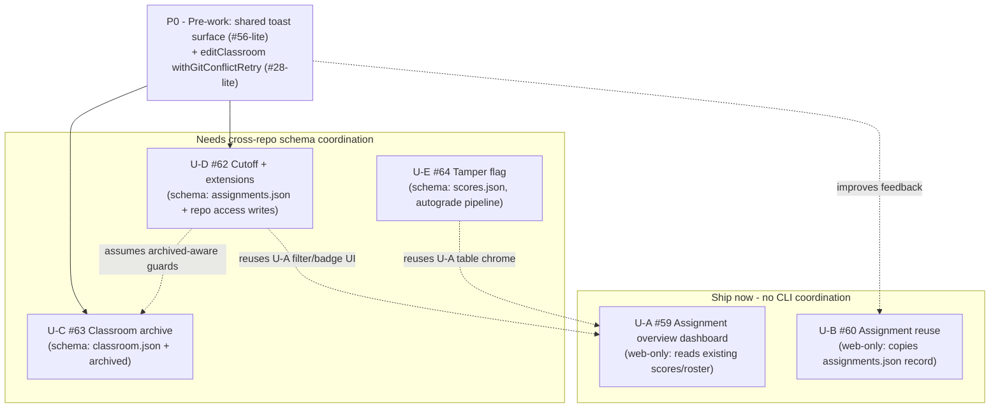

# feat: Top 5 GitHub Classroom parity features

**Created:** 2026-06-28
**Type:** feat (multi-feature roadmap)
**Depth:** Deep
**Status:** Planned
**Tracks issues:** #59, #60, #62, #63, #64 (with enabling pre-work for #56, #28, #57)

> This plan tracks the **top 5 priority features** to implement next, chosen to close the gap between `classroom50-web` and GitHub Classroom (which fully retires **2026-08-28**). It defines sequencing and the minimal refactoring required first. It is a roadmap-level plan: each feature has its own GitHub issue with detailed file references, and each should get its own focused PR.

---

## Summary

We will ship the five highest-value GitHub Classroom parity features, in dependency order, on top of a thin layer of enabling pre-work. The five features are: the **assignment overview dashboard** (#59), **assignment reuse** (#60), **cutoff dates + per-student extensions** (#62), **classroom archive** (#63), and a **tamper flag for protected-file edits** (#64).

The work is front-loaded with **right-sized pre-work only** — a shared toast/notification surface and a `withGitConflictRetry` wrapper on `editClassroom` — because three of the five features write new state and surface action results, and doing that on today's ad-hoc inline-alert + un-retried-write foundation would compound debt. We explicitly do **not** do a full refactoring phase first; broader refactors (logger #19, route guards #25, datasource consolidation #35, roster-helper dedup #57) are deferred.

The dominant sequencing constraint is **CLI schema coupling**: `classroom.json`, `assignments.json`, and `scores.json` are data contracts shared with the `gh-teacher` CLI and the `classroom50` skeleton repo. Features that only read/write web-owned UI state (#59 dashboard, #60 reuse) can ship immediately; features that add new schema fields (#62 cutoff, #63 archived, #64 tamper) must be coordinated cross-repo and are sequenced after the pure-UI wins.

---

## Problem Frame

GitHub Classroom retires on **2026-08-28**. `classroom50-web` is a mature, serverless (GitHub-as-backend) replacement whose teacher and student happy-paths are complete, but a [parity review](https://github.com/foundation50/classroom50-web/issues?q=label%3A%22UX%20Gap%22) found five capabilities GHC teachers rely on that we lack. Teachers evaluating a migration before August will hit these gaps in their first week:

- No **monitoring dashboard** for an assignment (counts, search, sort, filter, passing rollup) — our gradebook is a flat most-recent list, unusable past ~30 students.
- No **assignment reuse** — every assignment is recreated by hand each term.
- No **cutoff/extension** model — we record a soft due date but can't lock repos or grant per-student extensions.
- No **classroom archive** — past-semester classrooms accumulate forever with live accept links.
- No **tamper visibility** — `allowed_files` is authored and enforced, but a teacher never sees that a student edited the grading files.

## Scope

**In scope:** The 5 features above, plus the minimal pre-work that directly unblocks them.

**Out of scope / deferred:** see Scope Boundaries.

---

## Goals & Non-Goals

**Goals**

- Close the 5 highest-value GHC parity gaps before the August GHC retirement.
- Keep every new `*.json`/CSV field in lockstep with the `gh-teacher` CLI and `classroom50` skeleton schemas.
- Land each feature as an independently reviewable, independently shippable PR.
- Introduce only the shared infrastructure the 5 features actually need.

**Non-Goals**

- A full refactoring/foundation phase before features (explicitly rejected in planning).
- Manual grade override / in-app messaging / re-grade-all (#31) — separate value tracks, not parity.
- Schema rotation/migration tooling beyond what each feature needs.

---

## High-Level Technical Design

### Sequencing & dependency graph

The ordering is driven by two axes: **schema coupling** (web-only state ships now; shared-schema fields need cross-repo coordination) and **shared-infra dependency** (features that surface action results want the toast surface first).



> Dotted edges read "depends on / reuses": `A -.-> B` means A builds on B. So U-D and U-E reuse U-A's primitives, and U-D assumes U-C's archived-aware guards.

### Why this order

1. **#59 dashboard & #60 reuse first** — pure web wins, zero CLI coordination, immediate teacher value, and #59 builds the reusable filter/search/badge primitives the later features reuse. Lowest risk, highest "is this real?" signal for evaluators.
2. **Pre-work lands with the first schema-writing feature** — the toast surface and the `editClassroom` retry wrapper are pulled in just-in-time, not as a separate upfront phase.
3. **#63 archive next** — smallest schema change (one boolean), and it establishes the "archived-aware" guards that #62's cutoff logic also needs (a cutoff on an archived classroom is moot).
4. **#62 cutoff/extensions** — the heaviest feature: new assignment fields **and** GitHub repo write-access changes **and** per-student extension state. Benefits from the archive guards and the toast surface already existing.
5. **#64 tamper flag last** — depends on a `scores.json` field that the autograde/collect-scores pipeline (the `classroom50` repo, outside this codebase) must populate; the web side is then a read + badge. Most cross-repo, least web-only.

### Schema-coupling rule (applies to #62, #63, #64)

```text
Any new students.csv / assignments.json / classroom.json / scores.json field
  => coordinate with foundation50/classroom50-cli AND foundation50/classroom50 (skeleton)
  => follow the omitempty pattern (write only when set) so old tools still parse
  => add a round-trip test (present + absent) mirroring src/util/yaml.test.ts
```

---

## Refactoring Analysis: what to do first (and what not to)

Decision: **right-sized pre-work only.** Two small refactors are prerequisites because the features would otherwise bake in debt; everything else is deferred.

### Do first (pre-work, folded into early feature PRs)

| Pre-work                                                               | Why it must come first                                                                                                                                                                                                                                                                                               | Issue                                        |
| ---------------------------------------------------------------------- | -------------------------------------------------------------------------------------------------------------------------------------------------------------------------------------------------------------------------------------------------------------------------------------------------------------------- | -------------------------------------------- |
| **Shared toast/notification surface** (provider + `useToast`/`notify`) | #62, #63 (and #60) all surface action results from a control whose section may unmount (archive removes the card; reuse navigates away). Today this is ad-hoc inline `alert` divs + the one-off region in `EnrolledStudents.tsx`. Building three more one-offs entrenches the debt the parity features will lean on. | #56 (scoped-down)                            |
| **Wrap `editClassroom` in `withGitConflictRetry`**                     | #63 archive writes `classroom.json` via `editClassroom`, which (verified) is the only classroom write path **not** conflict-retried, unlike `editAssignment`/student mutations. Archive toggling on the shared `main` branch needs the same 409 protection.                                                          | #28 (the one sub-item that blocks a feature) |

### Explicitly deferred (do NOT block features on these)

| Deferred refactor                              | Why it can wait                                                                                                                                                             | Issue           |
| ---------------------------------------------- | --------------------------------------------------------------------------------------------------------------------------------------------------------------------------- | --------------- |
| Leveled logger / migrate remaining `console.*` | Cosmetic; `no-console` lint rule already prevents regressions.                                                                                                              | #19             |
| Role-based **route guards**                    | Real gap, but the 5 parity features are teacher-surface and already gated by `RequireTeacher` UI guards; route-layer enforcement is an orthogonal security hardening track. | #25             |
| Centralized roster datasource / prefetch       | Current per-page `useGetStudents` is adequate for these features.                                                                                                           | #35             |
| Roster helper dedup + CSV read coercion        | Maintainability debt; none of the 5 features add roster columns.                                                                                                            | #57             |
| Await/return `mutateAsync` across all forms    | Broader than the one `editClassroom` retry the features need.                                                                                                               | #28 (remainder) |

---

## Key Technical Decisions

- **KTD-1: Ship web-only features before schema-coupled ones.** #59 and #60 touch no shared schema, so they ship without CLI coordination and deliver value immediately. Rationale: de-risks the roadmap and front-loads visible parity.
- **KTD-2: New schema fields use `omitempty` + round-trip tests.** Mirrors the existing `secret`/`team` pattern in `createClassroomMetadata`; guarantees old CLI/skeleton versions still parse. Rationale: the CSV/JSON files are cross-binary contracts (see `docs/solutions/architecture-patterns/serverless-github-identity-reconciliation.md` §5).
- **KTD-3: #59 builds the reusable filter/search/badge primitives.** Later features (#62 late/extension badges, #64 tamper badge) reuse them rather than re-inventing. Rationale: avoids divergent table chrome.
- **KTD-4: Cutoff enforcement happens on teacher action / service-token workflow, not a server cron.** We have no backend; repo write-access revocation is applied via the GitHub API when the teacher acts (or via the existing service-token Actions workflow). Rationale: respects the serverless architecture.
- **KTD-5: Pre-work is pulled in just-in-time, not as an upfront phase.** The toast surface lands with the first feature that needs it; the `editClassroom` retry lands with #63. Rationale: keeps each PR focused and avoids a big-bang refactor PR.

---

## Open Questions

Resolve these before (or at the start of) the unit that owns each — they can change scope or schema.

- **OQ-1 (U-E semantics): allowlist vs. protected-paths.** Keep the existing `allowed_files` allowlist and frame the tamper signal as "edited a disallowed file," or add a distinct GHC-style protected-paths denylist? Affects the `scores/v1` field name/meaning and the badge copy. _Owner: U-E. Default: reuse `allowed_files` (no new authoring concept)._
- **OQ-2 (U-B scope): cross-org template copy in v1?** Reuse into a different org requires copying the template repo into the target org (mirroring GHC). Include in v1, or scope v1 to in-org reuse and document the limitation? _Owner: U-B. Default: in-org for v1; cross-org deferred to Follow-Up._
- **OQ-3 (U-A export): does CSV export respect the active filter?** Export only the filtered rows, or always export the full roster regardless of on-screen filters? Drives the U-A integration test. _Owner: U-A. Default: export the full roster (preserves today's "whole gradebook" behavior); revisit if teachers ask for filtered export._

---

## Implementation Units

> Each unit is one focused PR. Detailed file-level references live in the linked GitHub issue; this plan captures approach, dependencies, and test scenarios.

### U-P0. Enabling pre-work (toast surface + classroom-write retry)

- **Goal:** Add a shared notification surface and make `editClassroom` conflict-safe, so the schema-writing features build on solid ground.
- **Requirements:** Unblocks U-C, U-D; improves U-B feedback.
- **Dependencies:** none.
- **Files:** new `src/components/notifications/` (provider + `useToast` hook); `src/main.tsx` or app root (mount provider); `src/hooks/github/mutations.ts` (`editClassroom` → wrap in `withGitConflictRetry`); `src/pages/EditClassroomPage.tsx` (await/return the mutation).
- **Approach:** Generalize the page-level region pattern already in `src/pages/students/EnrolledStudents.tsx` into a provider + `notify()`/`useToast()` with tones (info/success/warning/error mapped to daisyUI `alert`), stacking, keyed dedup, optional auto-dismiss, and `role`/`aria-live`. Wrap `editClassroom` exactly like `editAssignmentWithConflictRetry`.
- **Patterns to follow:** `EnrolledStudents.tsx` notification region; `withGitConflictRetry` usage in `src/api/mutations/classrooms.ts`; `InlineNote` stays inline-only (non-goal to replace).
- **Test scenarios:**
  - Happy: `notify({tone})` renders a matching alert; multiple concurrent toasts stack; keyed toast replaces same-key prior.
  - Edge: toast survives the originating component unmounting (state lives above the page).
  - Error path: `editClassroom` retries on a simulated 409 and succeeds within the retry budget; exhausts retries → surfaces an error.
  - a11y: alerts expose `role="alert"`/`aria-live`; dismissible via keyboard.
- **Verification:** Archiving/reuse/extension actions can surface a result that persists after the triggering UI changes; an injected classroom-write 409 no longer drops the edit.

---

### U-A. Assignment overview dashboard (#59)

- **Goal:** Turn the flat submissions list into a monitoring surface: top-line counts incl. a passing rollup, plus search, sort, and filters.
- **Requirements:** Closes the #1 GHC parity gap; produces reusable filter/search/badge primitives (KTD-3).
- **Dependencies:** none (reads existing `scores.json`, `students.csv`, `assignments.json`). Can ship first.
- **Files:** `src/pages/SubmissionsPage.tsx` (stat strip + controls), `src/pages/submissions/SubmissionsTable.tsx` (filtered/sorted rows), new small `src/pages/submissions/` filter/search components; reuse `useGetScores`/`useGetStudents`/`useGetClassroomAssignments`.
- **Approach:** Derive passing/failing from each row's `score`/`max-score`. Add a search box (handle/name/identifier; team name for groups), sort (alpha A–Z/Z–A, newest, oldest), and filters (accepted/unaccepted, submitted/on-time/late/not-submitted, passing/failing, not-onboarded). All client-side over already-loaded data; no new fetches, no schema change.
- **Patterns to follow:** existing non-submitter derivation in `SubmissionsPage.tsx`; daisyUI table chrome in `SubmissionsTable.tsx`.
- **Test scenarios:**
  - Happy: counts (rostered/accepted/submitted/passing) compute correctly for individual and group assignments; default sort = most recent.
  - Edge: empty roster; all-passing and all-failing; group assignment (no roster denominator); ungraded (max-score 0) shown neutral, not as failing.
  - Filter/sort: each filter narrows rows correctly; combined filters AND together; clearing resets; sort orders are correct and stable.
  - Integration: CSV export honors the resolved OQ-3 decision (filtered vs. full export) — assert the exported rows match it.
- **Verification:** A teacher can find "late + failing" students in a 100-row class in one or two interactions.

---

### U-B. Assignment reuse across classrooms/semesters (#60)

- **Goal:** Let a teacher duplicate an assignment into another classroom (optionally another org).
- **Requirements:** Top GHC convenience; pure web write of an existing record shape.
- **Dependencies:** none for the core write. Soft dependency on U-P0 for the success/error toast (degrade to an inline alert if U-P0 hasn't landed). Cross-org template copy is a stretch sub-task (see Open Questions).
- **Files:** `src/pages/EditAssignmentPage.tsx` and/or `src/pages/assignments/AssignmentsTable.tsx` (Reuse/Duplicate action), `src/api/mutations/assignments.ts` (copy record into target `assignments.json`), reuse `createAssignment` write path.
- **Approach:** Add a "Reuse / Duplicate" action; pick a target classroom (and org the teacher can access). Copy the full `Assignment` record (name, template, mode, due/due_meta, autograder, tests, runtime, allowed_files, feedback_pr, max_group_size) into the target's `assignments.json`. For cross-org template reuse, mirror GHC by copying the template repo into the target org — or scope v1 to in-org and document the limitation (**OQ-2**).
- **Patterns to follow:** `createAssignment` in `src/api/mutations/assignments.ts`; uniqueness guard already throws on duplicate slug.
- **Test scenarios:**
  - Happy: duplicate within same classroom (new slug); duplicate into a different classroom in same org; copied record is field-for-field equal except identity.
  - Edge: target already has the slug → blocked with clear message; assignment with no template; group assignment carries `max_group_size`/`mode`.
  - Error path: target classroom write 409 retried; cross-org without template-copy permission surfaces an actionable error.
  - Integration: reused assignment appears in target classroom's assignments list and is acceptable by students.
- **Verification:** A teacher recreates last term's assignment in the new term's classroom in one action.

---

### U-C. Classroom archive / unarchive (#63)

- **Goal:** First-class archive lifecycle: archived classrooms block new assignments/accepts, keep data, and drop out of the default list.
- **Requirements:** GHC parity; smallest schema change (one boolean); establishes archived-aware guards reused by U-D.
- **Dependencies:** U-P0 (toast surface + `editClassroom` retry). **Schema coordination required** (KTD-2).
- **Files:** `src/types/classroom.ts` (`archived?: boolean`), `src/hooks/github/mutations.ts` (`createClassroomMetadata`/`editClassroom` write the field via the `omitempty` pattern), `src/pages/classes/EditClassroomForm.tsx` (Archive/Unarchive action, mirror the `onboarding_cleanup` control), `src/pages/ClassesPage.tsx` (`ClassCard` + Active/Archived/All filter), `src/pages/AcceptAssignmentPage.tsx` (refuse accept on archived classroom).
- **Approach:** Persist `archived` in `classroom.json`. When archived: disable "New assignment", disable assignment edits, block new accepts. Add an Active/Archived/All view filter on `ClassesPage` so archived classrooms hide by default but remain reachable.
- **Patterns to follow:** `...(secret ? {secret} : {})` omitempty in `createClassroomMetadata`; `onboarding_cleanup` select in `EditClassroomForm`.
- **Execution note:** Coordinate the `classroom/v1` field with `foundation50/classroom50-cli` and the skeleton repo before relying on it.
- **Test scenarios:**
  - Happy: archive → classroom leaves default list, appears under Archived/All; unarchive restores.
  - Edge: archived classroom hides "New assignment" and disables edits; legacy classroom with no `archived` field reads as active.
  - Error path: accept flow on an archived classroom is refused with a clear student-facing message; archive write 409 retried (via U-P0).
  - Integration: round-trip `classroom.json` with `archived` present and absent (mirror `yaml.test.ts`).
- **Verification:** A finished semester's classroom can be archived; its accept links stop working; the dashboard de-clutters.

---

### U-D. Cutoff dates + per-student deadline extensions (#62)

- **Goal:** A hard cutoff that revokes write access after the deadline, plus per-student/group extensions (and revoke).
- **Requirements:** Core GHC workflow (accommodations/extensions); heaviest feature.
- **Dependencies:** U-P0 (toast); benefits from U-C (archived-aware guards) and U-A (late/extension badge primitives). **Schema coordination required.**
- **Files:** `src/types/classroom.ts` (assignment cutoff fields distinct from soft `due`; extension state), `src/api/mutations/assignments.ts` (cutoff + extension writes; repo write-access revocation via GitHub API), create/edit assignment forms (cutoff input), `src/pages/submissions/SubmissionsTable.tsx` (extension actions + "Deadline extended" label).
- **Approach:** Add an optional **cutoff** flag/date separate from the soft `due`. On/after cutoff, downgrade each student's repo permission (respecting extensions). Add per-student/group **Extend deadline** / **Revoke extension** from the gradebook row, persisted in classroom/assignment state. Surface "Deadline extended" labels using U-A's badge primitives. Access changes happen on teacher action or via the service-token workflow (KTD-4).
- **Patterns to follow:** `buildDueFields`/`due_meta` provenance in `src/util/formatDate.ts`/`assignments.ts`; existing repo-permission writes in `src/hooks/github/mutations.ts`.
- **Execution note:** Coordinate the `assignments/v1` cutoff/extension fields cross-repo. Sequence after U-C so the cutoff logic can assume archived-aware guards.
- **Test scenarios:**
  - Happy: set cutoff → after cutoff a non-extended student loses write access; grant extension → that student retains/regains write; revoke → access removed again.
  - Edge: deadline with no cutoff behaves as today (soft "Late" label only); group extension applies to all members; teacher's own access never revoked.
  - Error path: permission-downgrade API failure surfaces via toast and is retryable; partial failure across a roster reports which students failed.
  - Integration: round-trip assignment JSON with/without cutoff + extensions; "Deadline extended" label renders in the table.
- **Verification:** A teacher can lock an assignment at a cutoff and grant one student a documented extension without touching GitHub directly.

---

### U-E. Tamper flag for protected/disallowed file edits (#64)

- **Goal:** Surface in the gradebook when a submission edited a protected/disallowed (grading) file.
- **Requirements:** GHC integrity signal; authoring of `allowed_files` already exists, so this is the missing _visibility_ half.
- **Dependencies:** U-A (table chrome/badge). **Cross-repo pipeline change required** — the autograde/collect-scores pipeline (in `foundation50/classroom50`) must emit the signal into `scores.json`; the web side then reads + badges.
- **Files:** `src/hooks/useGetScores.ts` (optional tamper field on the submission record), `src/pages/submissions/SubmissionsTable.tsx` (tamper badge + CSV export column). Pipeline emission lives in the `classroom50` repo (out of this codebase).
- **Approach:** Decide semantics first (**OQ-1**): keep the existing `allowed_files` allowlist and frame the signal as "edited a disallowed file," or add a distinct GHC-style protected-paths denylist. Then have collect-scores record an "edited protected/disallowed file" boolean per submission in `scores.json`; the web reads it and shows a tamper badge (and exports it).
- **Patterns to follow:** `SubmissionRecord` shape in `useGetScores.ts`; existing late-badge rendering in `SubmissionsTable.tsx`.
- **Execution note:** This is mostly a `classroom50`-repo pipeline change plus a small web read; sequence last. Confirm the `scores/v1` field cross-repo.
- **Test scenarios:**
  - Happy: a submission flagged in `scores.json` renders a tamper badge; unflagged rows show none.
  - Edge: legacy `scores.json` without the field → no badge, no crash; group submission flagged on the shared repo.
  - Integration: tamper state appears in the CSV export; allowlist vs protected-paths semantics decision is reflected in the label copy.
- **Verification:** A teacher sees, in the gradebook, that a student modified the files that grade them.

---

## Acceptance Examples

- **AE1 (#59):** In a 100-student class, filtering to "late + failing" returns exactly the matching rows; the passing count matches the number of rows at/above the pass threshold.
- **AE2 (#60):** Duplicating an assignment into next term's classroom yields a field-identical assignment (new slug) that students can accept.
- **AE3 (#63):** Archiving a classroom hides it from the default list and causes a student's accept attempt to be refused; unarchiving reverses both.
- **AE4 (#62):** After a cutoff passes, a non-extended student cannot push; granting that student an extension restores write access and shows a "Deadline extended" label.
- **AE5 (#64):** A submission that edits a protected file shows a tamper badge in the gradebook and an indicator in the CSV export.

---

## Scope Boundaries

**In scope:** U-P0 pre-work + U-A…U-E.

### Deferred to Follow-Up Work

- Full toast migration of all existing inline `alert`s (#56 remainder) — U-P0 ships the surface + first consumers only.
- Await/return `mutateAsync` across all forms (#28 remainder).
- Post-creation **secret rotation** and classroom-settings expansion (#9), org audit/preflight (#21).
- Cross-org template **repo copy** for reuse if v1 scopes to in-org.

### Outside this plan's scope (separate value tracks)

- Manual grade override / partial credit; in-app messaging; re-grade-all (#31); LMS roster sync; IDE/Codespaces; route-layer guards (#25); logger (#19); datasource consolidation (#35); roster-helper dedup (#57).

---

## Risks & Dependencies

- **R1 — CLI/skeleton schema drift (high).** #62/#63/#64 add shared-schema fields. _Mitigation:_ KTD-2 (omitempty + round-trip tests), coordinate with `classroom50-cli` and `classroom50` before merge; file companion issues.
- **R2 — #64 depends on an out-of-repo pipeline change (medium).** The tamper signal originates in the `classroom50` autograde/collect-scores pipeline. _Mitigation:_ sequence last; web work is a thin read that degrades gracefully when the field is absent.
- **R3 — Cutoff write-access revocation is multi-call across a roster (medium).** Partial failure can leave inconsistent access. _Mitigation:_ per-student result reporting via toast; idempotent re-apply; respect extensions; never touch the teacher's access.
- **R4 — Timeline vs GHC retirement 2026-08-28 (medium).** _Mitigation:_ the web-only wins (#59, #60) ship first and independently, so value lands even if schema-coordinated features slip.
- **R5 — Toast surface scope creep (low).** _Mitigation:_ U-P0 ships provider + first consumers only; broad migration deferred.

---

## Sources & Research

- Parity analysis and issue cross-check: this session's GitHub Classroom UX-gap review; issues #59, #60, #62, #63, #64 (and enabling #56, #28, #57).
- GitHub Classroom docs (assignments, autograding, feedback PRs, roster/classroom management, assignment overview, reuse, deadline extensions) — used to define parity targets; GHC retires 2026-08-28.
- Codebase: `src/pages/SubmissionsPage.tsx`, `src/pages/submissions/SubmissionsTable.tsx`, `src/pages/assignments/AssignmentsTable.tsx`, `src/pages/classes/EditClassroomForm.tsx`, `src/api/mutations/assignments.ts`, `src/hooks/github/mutations.ts` (`createClassroomMetadata`, `editClassroom`), `src/hooks/useGetScores.ts`, `src/types/classroom.ts`.
- Architecture/coupling: `docs/solutions/architecture-patterns/serverless-github-identity-reconciliation.md` (§5 cross-binary CSV/JSON contract), `CONCEPTS.md`.
