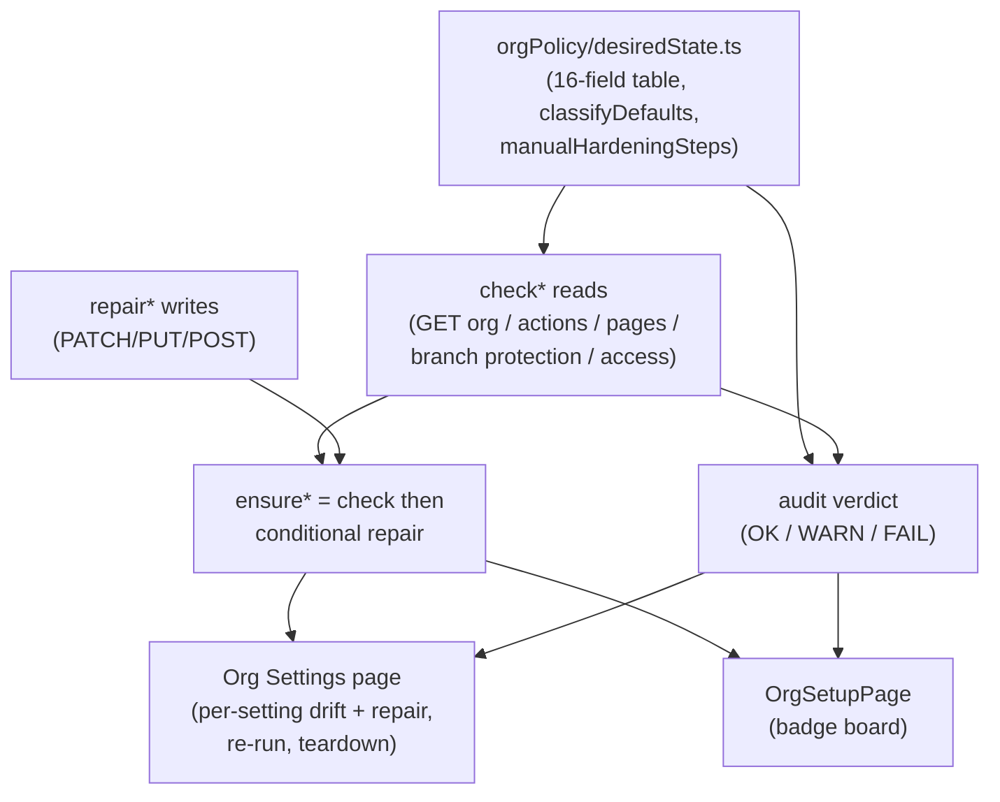
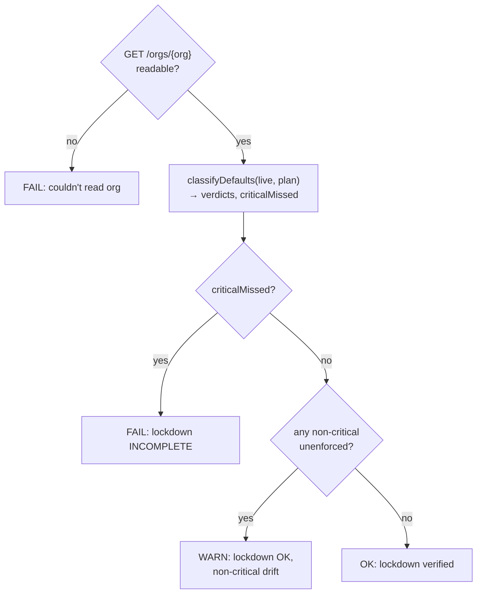

# Org Config Lifecycle Overhaul - Plan

## Goal Capsule

- **Objective:** Bring the GUI's org-config lifecycle to full parity with the `gh-teacher` CLI: mirror the CLI's `orgpolicy` verify/enforce model, centralize every org setting on the Org Settings page with per-setting drift + repair, add a read-only audit, and add lifecycle actions (persistent audit, re-run onboarding, destructive teardown).
- **Authority hierarchy:** The CLI (`classroom50-cli/internal/orgpolicy`, `internal/audit`, `init_repo.go`) is the source of truth for the policy field list, verdict semantics, and ruleset definitions. The web mirrors them; it does not invent new policy. Repo conventions and existing patterns (service-token pane, `ConfirmModal`, `useSafeSubmit`) override generic approaches.
- **Execution profile:** Web-only. No CLI changes. Strict mirroring of the CLI field list, three-state verdict, and the two ruleset definitions. TanStack Query/Router/Form + daisyUI; GitHub REST is the backend.
- **Stop conditions:** Surface a genuine blocker (a CLI/web policy divergence that can't be resolved by mirroring, or a destructive-scope decision the user must make) rather than guessing. The teardown deletion scope is pinned to "all org repos" (KTD5) but flagged in Open Questions.
- **Tail ownership:** `ce-work` or a human implementer owns execution unit-by-unit in dependency order.

---

## Product Contract

### Summary

The GUI can provision an org (a one-shot `init`-style wizard) and manage the service token, but it enforces a narrower policy than the CLI, has no read-only audit or drift detection, has no per-check repair (only re-running the whole wizard), exposes only the service token on the Org Settings page, and dead-ends the setup/audit wizard after onboarding. This plan closes all five gaps by adopting the CLI's shared desired-state seam, expanding enforcement to the full 16-field policy plus two org rulesets, centralizing all settings on the Org Settings page with per-setting drift + repair, and adding lifecycle actions (persistent audit, re-run onboarding, teardown).

### Problem Frame

The CLI solved "don't let apply and verify drift" with one shared desired-state definition (`internal/orgpolicy`) consumed by both `gh teacher init` (apply + verify) and `gh teacher audit` (read-only). The web's `ensure*` mutations instead entangle reads with writes — six of nine init concerns are write-first and classify state only in a catch branch, so no read-only audit can reuse them. The web also enforces only 2 of the CLI's 16 member-default fields, installs none of the CLI's rulesets, and surfaces only the service token to teachers. The result: an org reads "ready" even when branch protection, Pages, or member policy have silently regressed, and a teacher has no way to see, audit, repair, re-provision, or reset their org from the GUI.

### Requirements

**Desired-state parity (mirror the CLI)**

- R1. The web defines the same 16 member-default settings the CLI's `allMemberDefaultSettings()` defines, each carrying `field`, `value`, `desc`, `manualFix`, `critical`, and `enterpriseOnly`, with the exact field names, desired values, and criticality flags from the CLI.
- R2. The web applies plan-aware filtering equivalent to `MemberDefaultSettings(plan)`: `enterprise` plan returns all 16 fields; any other plan (`team`, `free`, unknown) filters out the 4 `enterpriseOnly` fields, returning 12.
- R3. The web implements a `classifyDefaults(live, plan)` compare equivalent to the CLI's `ClassifyDefaults`: per-setting `{ setting, enforced }` verdicts plus a `criticalMissed` boolean, using direct equality against the live `GET /orgs/{org}` values.
- R4. The web surfaces the 4 manual-only settings (no REST API) as a checklist mirroring the CLI's `ManualHardeningSteps`, each linking to the org member-privileges settings page.

**Read-only audit + drift detection**

- R5. The web computes a read-only audit verdict mirroring the CLI's three-state model: OK when the lockdown is complete and no settings drifted; WARN when complete but non-critical settings drifted; FAIL when any critical setting is unenforced or the org can't be read.
- R6. Each init concern has a standalone non-mutating `check*` that returns the current value and a verdict without writing.
- R7. Drift is visible on the org surfaces: an org that reads "ready" still shows policy regressions via the audit verdict.

**Full enforcement parity**

- R8. `orgDefaults` enforcement expands from 2 fields to the full plan-filtered policy, applied via a combined `PATCH /orgs/{org}` with a per-field 403/422 fallback and an authoritative read-back, mirroring the CLI's `applyOrgMemberDefaults`.
- R9. The web installs and reconciles the two org branch rulesets the CLI installs (`classroom50-protect-submission-history` on the default branch with `non_fast_forward` + `deletion`; `classroom50-feedback-base-lock` on `refs/heads/feedback` with `update` + `deletion`), both with an `OrganizationAdmin` always-bypass, reconciled by name (create or PUT-over-existing).

**Centralized Org Settings page**

- R10. Every org-API and classroom50-repo setting is exposed on the Org Settings page as its own section, cloning the service-token pane pattern (read hook → configured/drift banner → per-setting repair).
- R11. Org-level writes are gated on org-owner (`membership.role === "admin"`), shown read-only to non-owners; the page stays teacher-gated overall.

**Lifecycle: persistent audit, re-run onboarding, teardown**

- R12. The audit verdict is reviewable from the Org Settings page at any time after onboarding, not just during the initial wizard.
- R13. A "re-run onboarding / setup" action on the Org Settings page re-invokes the idempotent `initClassroom50` (apply + re-enforce), surfacing the same per-step badge board, owner-gated.
- R14. A destructive teardown action on the Org Settings page deletes the org's repos behind a typed-org-name confirmation, marker-gated (refuses any org without `<org>/classroom50`), printing the deletion plan first, deleting the marker repo last, owner-gated.
- R15. Teardown handles the `delete_repo` scope wall (surfaces an actionable message on 403) and throttles bulk deletion to respect rate limits.

### Scope Boundaries

**In scope:** the org-policy desired-state seam, the `check*`/`repair*` refactor, full 16-field enforcement parity, the two org rulesets, the centralized Org Settings page with per-setting drift + repair, the read-only audit verdict + drift visibility, re-run onboarding, and teardown (repo deletion).

**Deferred to follow-up work**

- A true org-settings revert (set fields back to pre-init values). Init never stores pre-init values, so a revert can only guess GitHub defaults, with plan-coupling pitfalls. Re-running init (R13) is the supported "reset to our policy" in v1 (KTD6).
- A managed-only teardown filter (deleting only classroom50-managed repos). v1 mirrors the CLI's all-org-repos scope (KTD5); a narrower filter has no reliable "managed-by" signal.

**Outside this product's identity**

- Per-classroom config (`classroom.json` / `assignments.json` / `students.csv` / `scores.json`) — classroom-level, owned elsewhere.
- The broader settings *surfaces* tracked in #9; this issue owns the org-policy enforce + audit + drift lifecycle and the org-settings centralization.

### Dependencies

- Cross-binary: the authoritative policy lives in `classroom50-cli` (`internal/orgpolicy`, `internal/audit`, `init_repo.go`). The web must stay in lockstep — the field list, verdict semantics, and ruleset definitions are mirrored, not re-decided. A divergence is a parity bug.
- The `delete_repo` OAuth scope is opt-in and absent from default sessions; teardown depends on it (R15).

### Sources

- CLI policy model: `classroom50-cli/cli/gh-teacher/internal/orgpolicy/orgpolicy.go` (`MemberDefaultSetting`, `allMemberDefaultSettings()`, `MemberDefaultSettings(plan)`, `ClassifyDefaults`, `ManualHardeningSteps`).
- CLI audit verdict: `classroom50-cli/cli/gh-teacher/internal/audit/audit.go` (`auditReport`, `buildAuditReport`, OK/WARN/FAIL switch).
- CLI enforce + rulesets: `classroom50-cli/cli/gh-teacher/init_repo.go` (`applyOrgMemberDefaults`, `applyOrgMemberDefaultsPerField`, `verifyOrgDefaults`, `ensureClassroomRulesets`, ruleset definitions, `listOrgRulesets`/`createOrgRuleset`/`updateOrgRuleset`).
- CLI teardown: `classroom50-cli/cli/gh-teacher/internal/teardown/teardown.go` (marker gate, typed confirm, delete-marker-last).
- Web init spine: `src/hooks/github/mutations.ts` (`initClassroom50` and the nine `ensure*` functions).
- Web status/reads: `src/hooks/github/queries.ts` (`getClassroom50OrgSummary`, `getServiceTokenStatus`, `getRepo`, `getOrgRepos`, `paginateAll`, `listOnboardingRepos`).
- Web settings pane pattern: `src/pages/OrgSettingsPage.tsx` (`OrgSettingsPane`, `TOKEN_STATUS_BANNER`, `patMutation`).
- Web wizard: `src/pages/OrgSetupPage.tsx` (`INIT_STEP_ORDER`, `InitStep`, badge board, `NotAdminAlert`, owner gate).
- Web destructive guard: `src/components/modals/index.tsx` (`ConfirmModal`, type-to-confirm + latch).

---

## Planning Contract

### Key Technical Decisions

- KTD1. **Port the CLI's desired-state model into a single web module, not per-pane constants.** Create `src/orgPolicy/desiredState.ts` (the web mirror of `internal/orgpolicy`) holding the 16-field table, `memberDefaultSettings(plan)` filtering, `classifyDefaults(live, plan)`, and `manualHardeningSteps(org)`. Both the audit and the settings page consume this one module so they can't drift from each other or from the CLI. Rationale: the CLI's whole anti-drift design is one shared seam; replicating that is the point of the issue.

- KTD2. **Split each entangled `ensure*` into a `check*` (read-only verdict) and a `repair*` (write), keeping `ensure*` as `check`-then-conditional-`repair`.** The `check*` returns `{ value, verdict }` without writing; the `repair*` performs the write; `ensure*` (used by `initClassroom50`) becomes `check` → repair-if-needed. This gives the audit and settings page reusable reads while preserving the wizard's behavior. Rationale: six of nine concerns are write-first today; the audit cannot reuse them as-is.

- KTD3. **Add the six missing standalone reads.** `checkOrgDefaults` (`GET /orgs/{org}`), `checkOrgActions` (`GET /orgs/{org}/actions/permissions` — export the currently-private `getOrgActionsPermissions`), `checkOrgPrCreation` (factor out the inline `GET /orgs/{org}/actions/permissions/workflow`), `checkBranchProtection` (`GET .../branches/{b}/protection`), `checkReusableWorkflowAccess` (`GET .../actions/permissions/access`), `checkPages` (`GET .../pages`). `configRepo`/`skeleton`/`workflowPermissions` already have reusable reads (`getRepo`, `findMissingSkeletonFiles`, `getRepoWorkflowPermissions`).

- KTD4. **Mirror the CLI enforce pattern exactly for `orgDefaults`: combined PATCH → 403/422 per-field fallback → authoritative read-back via `classifyDefaults`.** A 200 is not proof the values stuck (enterprise-pinned fields silently no-op), so the read-back is the source of truth for the unenforced checklist. Secondary-rate-limit 403 is treated as transient (do not fall back). Rationale: this is the CLI's hard-won behavior; deviating reintroduces the silent-no-op bug.

- KTD5. **Teardown deletes ALL org repos, mirroring the CLI.** Marker-gated (refuse any org without `<org>/classroom50`), print the full deletion plan, require typed-org-name confirmation via `ConfirmModal`, delete the `classroom50` marker repo last (re-runnable on interruption). No managed-only naming filter — the web has no reliable "managed-by" signal, and the CLI deliberately chose all-repos. Flagged in Open Questions for user override. Rationale: honesty over a leaky filter; matches the CLI.

- KTD6. **No org-settings revert in v1; re-run onboarding is the "reset to our policy."** `initClassroom50` is already idempotent, so the re-run path doubles as the repair-everything action. A true revert can only guess GitHub defaults (no stored baseline) and has plan-coupling pitfalls. Teardown is repo-deletion only, like the CLI.

- KTD7. **Org-owner gate uses `useGetOrgMembership` role `"admin"`, reusing `NotAdminAlert`.** Org-level writes (member defaults, rulesets, teardown, re-run) require owner; the page stays teacher-gated via `RequireTeacher`, but owner-only sections show read-only verdicts to non-owner teachers. Rationale: setup/teardown are owner-only in both the CLI and the existing wizard.

- KTD8. **Clone the service-token pane shape for every setting section.** `useGet<Check>(org)` query → `STATUS_BANNER[verdict]` descriptor lookup → banner with descriptor icon/title + message → `useMutation({ mutationFn: repair, onSuccess: invalidate })` → form through `useSafeSubmit`, button reflects `isPending`, inline error from `mutation.error`. Rationale: the existing pane is the established, tested pattern; consistency lowers review and maintenance cost.

### High-Level Technical Design

The spine is the desired-state seam (KTD1) feeding three consumers: the wizard (apply + verify), the audit (read-only verdict), and the settings page (per-setting drift + repair). The `check*`/`repair*` split (KTD2) is what lets all three share one set of reads.

Audit verdict (mirrors `buildAuditReport` + the OK/WARN/FAIL switch):

### Sequencing

Phase order is A → B → C → D, with the seam and refactor first because everything depends on it:

1. **A (spine):** U1 desired-state module, U2 `check*`/`repair*` refactor + missing reads.
2. **B (parity):** U3 full 16-field enforcement, U4 the two rulesets.
3. **C (settings UI):** U5 audit verdict + hook, U6 centralized Org Settings sections, U7 drift visibility on org surfaces.
4. **D (lifecycle):** U8 re-run onboarding, U9 teardown.

### Assumptions

- The org billing plan (`GitHubOrgDetails.plan.name`) is read via the existing `useGetOrgPlanDetails`; `enterprise` unlocks the 4 enterprise-only fields, everything else (including unknown/empty) is treated as non-enterprise — matching the CLI.
- `"classroom50"` is the marker/config repo name; the plan introduces a shared exported constant rather than relying on the module-private `CONFIG_REPO` and scattered string literals where the new code needs it.

---

## Implementation Units

### U1. Org-policy desired-state module (the web mirror of `internal/orgpolicy`)

- **Goal:** A single source-of-truth module holding the 16-field member-default table, plan-aware filtering, the `classifyDefaults` compare, and the manual-hardening checklist — mirroring the CLI exactly.
- **Requirements:** R1, R2, R3, R4.
- **Dependencies:** none.
- **Files:** `src/orgPolicy/desiredState.ts` (new), `src/orgPolicy/desiredState.test.ts` (new).
- **Approach:** Define `MemberDefaultSetting = { field, value, desc, manualFix, critical, enterpriseOnly }` and the 16-entry table with the exact field names/values/flags from the CLI (KTD1). Implement `memberDefaultSettings(plan)`: `enterprise` returns all 16, anything else filters out the 4 `enterpriseOnly` fields (`members_can_create_public_repositories`, `members_can_create_internal_repositories`, `members_can_view_dependency_insights`, `members_can_invite_outside_collaborators`). Implement `classifyDefaults(live, plan)` returning `{ verdicts: { setting, enforced }[], criticalMissed }` using direct equality. Implement `manualHardeningSteps(org)` returning the 4 API-less steps, all linking to `https://github.com/organizations/{org}/settings/member_privileges`.
- **Patterns to follow:** Mirror `allMemberDefaultSettings()` and `ClassifyDefaults` from `classroom50-cli/cli/gh-teacher/internal/orgpolicy/orgpolicy.go` field-for-field. Keep the non-critical set exactly: fields 3 (`members_can_create_private_repositories`), 6 (`members_can_create_pages`), 7 (`members_can_create_public_pages`).
- **Test scenarios:**
  - `memberDefaultSettings("enterprise")` returns 16 settings; `memberDefaultSettings("team")`, `("free")`, `("")` each return 12 with the 4 enterprise-only fields absent.
  - The table's critical flags match the CLI: every field critical except #3, #6, #7.
  - `classifyDefaults` with all live values matching desired → all `enforced: true`, `criticalMissed: false`.
  - `classifyDefaults` with one critical field wrong → that verdict `enforced: false`, `criticalMissed: true`.
  - `classifyDefaults` with only a non-critical field wrong (e.g. `members_can_create_pages`) → `criticalMissed: false`, that verdict unenforced.
  - `classifyDefaults` on `team` plan ignores enterprise-only fields even if live values for them are wrong.
  - `manualHardeningSteps("acme")` returns 4 steps, each URL pointing at `acme`'s member-privileges page.
- **Verification:** Unit tests pass; the field list is a 1:1 match to the CLI table (spot-checked against `orgpolicy.go`).

### U2. Split `ensure*` into `check*` + `repair*` and add the six missing reads

- **Goal:** Every init concern has a standalone non-mutating `check*` returning `{ value, verdict }`; `repair*` performs the write; `ensure*` becomes check-then-conditional-repair, preserving wizard behavior.
- **Requirements:** R6.
- **Dependencies:** U1.
- **Files:** `src/hooks/github/mutations.ts` (refactor the nine `ensure*`), `src/hooks/github/orgChecks.ts` (new — the `check*` reads), `src/hooks/github/orgChecks.test.ts` (new).
- **Approach:** Add the six missing reads (KTD3): `checkOrgDefaults` (`GET /orgs/{org}`, classify via U1), `checkOrgActions` (`GET /orgs/{org}/actions/permissions`; export `getOrgActionsPermissions`), `checkOrgPrCreation` (factor out the inline `GET /orgs/{org}/actions/permissions/workflow`), `checkBranchProtection` (`GET .../branches/{b}/protection`, assert `allow_force_pushes.enabled === false && allow_deletions.enabled === false`), `checkReusableWorkflowAccess` (`GET .../actions/permissions/access`, assert `access_level === "organization"`), `checkPages` (`GET .../pages`, assert exists with `build_type === "workflow"` and `public === true`). Reuse `getRepo`, `findMissingSkeletonFiles`, `getRepoWorkflowPermissions` for the three concerns that already have reads. Each `check*` tolerates 404/403 with a verdict (`missing`/`unreadable`) rather than throwing. Refactor each `ensure*` to call its `check*` first and only `repair*` when not already enforced — but keep `initClassroom50`'s step order, `tryStep`/`warningCodes`, and the two hard-prerequisite gates (after `configRepo`, after `skeleton`) intact.
- **Patterns to follow:** `ensureOrgCanCreatePullRequests` already does read-then-conditional-write — generalize that shape. `getRepo`'s 404→null tolerance is the model for the new tolerant reads.
- **Test scenarios:**
  - Each `check*` returns `enforced: true` when the fake client serves the desired live value, `enforced: false` when it serves a drifted value.
  - `checkBranchProtection` returns unenforced when `allow_force_pushes.enabled` is true; enforced when both force-push and deletion are disabled.
  - `checkPages` returns `missing` on 404, enforced when `build_type === "workflow"` and `public`.
  - `checkOrgActions` returns enforced only when `enabled_repositories === "all" && allowed_actions === "all"`.
  - `check*` on a 403 returns an `unreadable` verdict, not a throw.
  - `ensureBranchProtection` no-ops the write when `checkBranchProtection` already reports enforced (assert no PUT fired on the fake client).
  - `initClassroom50` still stops after a failed `configRepo` and after a failed `skeleton` (existing behavior preserved).
- **Verification:** Unit tests pass; `initClassroom50` produces the same badge-board outcomes as before on a fresh org; `npm run check` clean.

### U3. Expand `orgDefaults` enforcement to the full plan-filtered policy

- **Goal:** Replace the 2-field `updateOrgClassroomSafetyDefaults` PATCH with the full plan-filtered lockdown, applied via combined PATCH → per-field 403/422 fallback → authoritative read-back.
- **Requirements:** R8.
- **Dependencies:** U1, U2.
- **Files:** `src/hooks/github/mutations.ts` (`repairOrgDefaults` replacing `updateOrgClassroomSafetyDefaults`), `src/hooks/github/mutations.test.ts` (extend or new).
- **Approach:** Build the combined body from `memberDefaultSettings(plan)`. `PATCH /orgs/{org}` once; on 403/422 (non-rate-limit) drop to per-field PATCH (`{field: value}` each, skipping 403/422 fields silently); on secondary-rate-limit 403 surface a transient error and do not fall back (KTD4). After either path, read the org back and run `classifyDefaults` — the read-back is the source of truth for the unenforced checklist and the `criticalMissed` result. Plumb the org `plan` (from `useGetOrgPlanDetails` / `GET /orgs/{org}`) into the call. The result carries the unenforced settings (field + manualFix + critical) so the wizard and settings page can render the actionable checklist.
- **Patterns to follow:** Mirror `applyOrgMemberDefaults`, `applyOrgMemberDefaultsPerField`, and `verifyOrgDefaults` from `classroom50-cli/cli/gh-teacher/init_repo.go` — including the secondary-rate-limit guard and the "200 is not proof" read-back.
- **Test scenarios:**
  - Combined PATCH succeeds, read-back shows all enforced → result complete, no unenforced.
  - Combined PATCH returns 422 → per-field fallback fires; a field that 422s individually is skipped; read-back classifies residual state.
  - A critical field silently ignored (200 but read-back shows drift) → result reports `criticalMissed: true` with that field in the checklist.
  - Secondary-rate-limit 403 on the combined PATCH → transient error surfaced, no per-field fallback (assert single PATCH attempted).
  - `team` plan → only 12 fields in the PATCH body (enterprise-only absent).
  - Read-back failure → result does not manufacture a false checklist (mirrors CLI: warn, treat as ok).
- **Verification:** Unit tests pass; on a real team org the lockdown applies the 12 expected fields; `npm run check` clean.

### U4. Install and reconcile the two org branch rulesets

- **Goal:** Create/reconcile `classroom50-protect-submission-history` and `classroom50-feedback-base-lock` exactly as the CLI does, as a new init concern and repair.
- **Requirements:** R9.
- **Dependencies:** U2.
- **Files:** `src/hooks/github/rulesets.ts` (new — definitions + check/repair), `src/hooks/github/rulesets.test.ts` (new), `src/hooks/github/mutations.ts` (wire `ensureClassroomRulesets` into `initClassroom50`), `src/pages/OrgSetupPage.tsx` (add a `rulesets` badge-board step).
- **Approach:** Define the two `orgRulesetBody` payloads verbatim from the CLI: ruleset 1 target `branch`, `enforcement: "active"`, `ref_name.include: ["~DEFAULT_BRANCH"]`, `repository_name.include: ["~ALL"]`, bypass `[{actor_id: 1, actor_type: "OrganizationAdmin", bypass_mode: "always"}]`, rules `[{type: "non_fast_forward"}, {type: "deletion"}]`; ruleset 2 same shape but `ref_name.include: ["refs/heads/feedback"]` and rules `[{type: "update"}, {type: "deletion"}]`. `checkRulesets`: `GET /orgs/{org}/rulesets` (paginate-all, 100/page), map name→id, report which of the two exist. `repairRulesets`: for each, PUT-over-existing if name matches, else POST to create. Warn-and-continue on any single failure (init never fails on a ruleset error); the concern reports `allReady` = no failures.
- **Patterns to follow:** Mirror `ensureClassroomRulesets`, `listOrgRulesets`, `createOrgRuleset`, `updateOrgRuleset` and the ruleset definitions in `classroom50-cli/cli/gh-teacher/init_repo.go`. Use the existing `paginateAll` from `queries.ts` for the list.
- **Test scenarios:**
  - Neither ruleset exists → two POSTs fire with the exact payloads; result `allReady: true`.
  - Both exist → two PUTs fire over the matched ids (reconcile), no POSTs.
  - One exists, one missing → one PUT + one POST.
  - A create failure → warned, `allReady: false`, the other still attempted.
  - `checkRulesets` reports `enforced: false` when a ruleset is absent, `true` when both present.
  - Payload assertion: ruleset 2 targets `refs/heads/feedback` with `update`+`deletion`; ruleset 1 targets `~DEFAULT_BRANCH` with `non_fast_forward`+`deletion`; both carry the OrganizationAdmin always-bypass.
- **Verification:** Unit tests pass; the wizard shows a `rulesets` step; on a real org both rulesets appear under org settings → rules; `npm run check` clean.

### U5. Audit verdict + hook (read-only, three-state)

- **Goal:** Compute the OK/WARN/FAIL audit verdict from the `check*` reads + `classifyDefaults`, exposed as a query hook for the UI.
- **Requirements:** R5, R6.
- **Dependencies:** U1, U2, U4.
- **Files:** `src/orgPolicy/audit.ts` (new — `buildOrgAuditReport`), `src/orgPolicy/audit.test.ts` (new), `src/hooks/useGetOrgAudit.ts` (new — TanStack Query hook).
- **Approach:** `buildOrgAuditReport(client, org, plan)` reads `GET /orgs/{org}`, runs `classifyDefaults`, and assembles `{ org, plan, readOk, lockdownComplete, enforced[], unenforced[], manualUnreadable[], settingsUrl }` plus the per-concern check verdicts (actions, PR creation, pages, branch protection, reusable access, rulesets, skeleton, service token). Verdict: read failure → FAIL; `criticalMissed` → FAIL; complete but non-critical drift → WARN; else OK (mirrors the CLI switch). `lockdownComplete = !criticalMissed`; unreadable manual items never affect it. The hook wraps it with a sensible `staleTime` and the org-scoped query key.
- **Patterns to follow:** Mirror `buildAuditReport` and the OK/WARN/FAIL switch in `classroom50-cli/cli/gh-teacher/internal/audit/audit.go`. Hook shape follows `useGetServiceTokenStatus` / `useGetOrgPlanDetails`.
- **Test scenarios:**
  - All concerns enforced, org readable → verdict OK, `lockdownComplete: true`, empty `unenforced`.
  - A critical member-default unenforced → FAIL, that field in `unenforced` with its `manualFix`.
  - Only a non-critical field drifted → WARN, `lockdownComplete: true`.
  - `GET /orgs/{org}` fails → FAIL, `readOk: false`, `unenforced` empty (inconclusive, not "all enforced").
  - `manualUnreadable` always contains the 4 manual steps regardless of verdict and never flips the verdict to FAIL.
  - A drifted ruleset (absent) surfaces in the report's per-concern verdicts.
- **Verification:** Unit tests pass; the verdict matches the CLI `audit` output on the same org state; `npm run check` clean.

### U6. Centralized Org Settings page (per-setting drift + repair)

- **Goal:** Surface every org-API and classroom50-repo setting on the Org Settings page as its own section, cloning the service-token pane, with per-setting drift banners and repair actions; owner-gated writes.
- **Requirements:** R10, R11.
- **Dependencies:** U2, U3, U4, U5.
- **Files:** `src/pages/OrgSettingsPage.tsx` (add sections), `src/pages/orgSettings/SettingSection.tsx` (new — the reusable pane), `src/pages/orgSettings/sections.ts` (new — section descriptors), `src/pages/orgSettings/SettingSection.test.tsx` (new).
- **Approach:** Build a generic `SettingSection` from the service-token pane shape (KTD8): a `useGet<Check>` query → `STATUS_BANNER[verdict]` descriptor → banner with icon/title/message → `useMutation({ mutationFn: repair, onSuccess: invalidate })` → form via `useSafeSubmit`, button reflects `isPending`, inline error from `mutation.error`. Group sections: **org-level** (member defaults with the full unenforced checklist + repair, org Actions, org PR creation, rulesets) and **classroom50-repo-level** (Pages, branch protection, workflow permissions, reusable-workflow access, service token). Skeleton renders as "files present/missing", not a toggle. Gate org-level repair buttons on `useGetOrgMembership` role `admin` (KTD7); non-owner teachers see read-only verdicts. Keep the existing service-token pane as one of the sections (do not regress it).
- **Patterns to follow:** `OrgSettingsPane` + `TOKEN_STATUS_BANNER` + `patMutation` in `src/pages/OrgSettingsPage.tsx`; `RequireTeacher` wrapping; `NotAdminAlert` from `OrgSetupPage.tsx` for non-owner messaging; `useSafeSubmit` from `src/hooks/useSafeSubmit.ts`.
- **Test scenarios:**
  - Each section renders its descriptor banner for enforced/drifted/unreadable verdicts (descriptor lookup correct).
  - A repair button fires the corresponding `repair*` and invalidates the audit + org queries on success.
  - Non-owner teacher: org-level repair buttons hidden/disabled, verdict still shown read-only.
  - Member-defaults section lists each unenforced field with its `manualFix`.
  - Service-token section still validates-then-writes and shows updated/saved (no regression).
  - Double-submit guarded (`useSafeSubmit`): a second click while pending is a no-op.
- **Verification:** Settings page shows all sections with live verdicts; repairs work end-to-end on a real org; service-token flow unchanged; `npm run check` clean.

### U7. Drift visibility on org surfaces

- **Goal:** An org that reads "ready" still surfaces policy regressions via the audit verdict on `OrgsPage` and `OrgSettingsPage`.
- **Requirements:** R7.
- **Dependencies:** U5.
- **Files:** `src/pages/OrgsPage.tsx` (badge/indicator), `src/pages/OrgSettingsPage.tsx` (verdict header).
- **Approach:** Surface the audit verdict (OK/WARN/FAIL) as a compact indicator on the org card (`OrgsPage`) and a header summary on the settings page. Do not change `getClassroom50OrgSummary`'s coarse `ready` status (it stays "config repo visible"); layer the audit verdict on top so a "ready" org with drift shows a WARN/FAIL indicator. Lazy/secondary fetch so it doesn't block the org list render.
- **Patterns to follow:** The `needs_setup`/`ready` card states in `OrgsPage.tsx`; the banner descriptor pattern for the indicator styling.
- **Test scenarios:**
  - A "ready" org with a critical drift shows a FAIL indicator; with only non-critical drift shows WARN; fully enforced shows OK (or no badge).
  - The audit fetch failing does not break the org list (indicator falls back to neutral/unknown).
  - `needs_setup` orgs are unaffected (still show "Set Up").
- **Verification:** Drifted orgs are visually flagged; clean orgs are not noisy; `npm run check` clean.

### U8. Re-run onboarding from Org Settings

- **Goal:** An owner can re-invoke the idempotent `initClassroom50` from the Org Settings page, surfacing the same per-step badge board, as the "repair everything" path.
- **Requirements:** R12, R13.
- **Dependencies:** U2, U3, U4, U6.
- **Files:** `src/pages/orgSettings/RerunOnboarding.tsx` (new), `src/pages/OrgSettingsPage.tsx` (mount it), possibly extract the badge board from `OrgSetupPage.tsx` into a shared `src/pages/orgSettings/InitStepBoard.tsx` (new) to avoid duplication.
- **Approach:** Reuse the wizard's `INIT_STEP_ORDER`, `InitStep`, `applyStepUpdate`, and the `initClassroom50` mutation with `onStepUpdate`. Wrap the trigger in `useSafeSubmit`. Owner-gated (KTD7) with `NotAdminAlert` for non-owners. On completion, invalidate the audit + org queries so drift indicators refresh. Because `initClassroom50` resolves with `status: "error"` rather than throwing on a prerequisite failure, surface that as a failed-step board (mirror `OrgSetupPage`'s `data.status === "error"` handling).
- **Patterns to follow:** `OrgSetupPage.tsx` stage-1 board, `applyStepUpdate`, the `mutation.onSuccess` that checks `data.status === "error"`. Extract rather than copy the board if feasible.
- **Test scenarios:**
  - Triggering re-run drives the badge board through running→complete for each step (fake `initClassroom50`).
  - A prerequisite failure (`configRepo` error) stops the board and surfaces the error without advancing.
  - Non-owner: action hidden/disabled, `NotAdminAlert` shown.
  - Completion invalidates the audit query (drift indicators refresh).
  - Double-trigger guarded by `useSafeSubmit`.
- **Verification:** Re-run repairs a drifted org and the board reflects per-step status; `OrgSetupPage` still works (no regression from extraction); `npm run check` clean.

### U9. Teardown / org reset (destructive, all org repos)

- **Goal:** An owner can tear down the org — deleting all org repos — behind a marker gate and typed-org-name confirmation, mirroring the CLI's teardown.
- **Requirements:** R14, R15.
- **Dependencies:** U6.
- **Files:** `src/api/mutations/teardown.ts` (new — orchestration), `src/api/mutations/teardown.test.ts` (new), `src/pages/orgSettings/TeardownSection.tsx` (new), `src/pages/OrgSettingsPage.tsx` (mount it).
- **Approach:** Marker gate: refuse if `getRepo(org, "classroom50")` is absent (KTD5). Enumerate repos via the existing `getOrgRepos` (paginate-all). Order deletions so the `classroom50` marker repo is deleted **last** (re-runnable on interruption). Delete via the existing `deleteRepo`; throttle with bounded concurrency (`mapWithConcurrency`) and backoff for rate limits (R15). On 403, surface an actionable "needs `delete_repo` scope" message and stop (optionally offer archive-via `archiveRepo` as a non-destructive alternative — keep that copy in the modal). UI: a `dangerous` `ConfirmModal` with `confirmText={org}` (type the org name) showing the full deletion plan (repo count + names) before confirming; owner-gated with `NotAdminAlert`. No settings revert (KTD6).
- **Patterns to follow:** Marker gate + typed confirm + delete-last from `classroom50-cli/cli/gh-teacher/internal/teardown/teardown.go`. `ConfirmModal` (`src/components/modals/index.tsx`) with `needsConfirm`/`confirmText`/`dangerous`. `deleteRepo`/`archiveRepo` and the 403→archive fallback already used in roster reconcile (`src/api/mutations/students.ts`). `getOrgRepos`/`paginateAll` from `queries.ts`.
- **Test scenarios:**
  - Marker absent → teardown refuses, no deletes attempted.
  - Marker present, 3 repos → all deleted, `classroom50` deleted last (assert call order on the fake client).
  - A `delete_repo` 403 → actionable scope message surfaced; teardown stops (no silent partial wipe beyond what already ran).
  - Confirmation requires typing the exact org name (`ConfirmModal` `canSubmit` false until match).
  - Non-owner: teardown action hidden/disabled.
  - Interruption safety: with the marker deleted last, a re-run after partial completion still passes the marker gate (assert marker still present after a mid-run failure).
  - Rate-limit/throttle: deletions run with bounded concurrency (assert no unbounded fan-out).
- **Verification:** Teardown deletes all org repos on a disposable test org with the marker last; refuses non-marker orgs; surfaces the scope wall clearly; `npm run check` clean.

---

## Verification Contract

| Gate | Command | Applies to | Done signal |
|---|---|---|---|
| Types | `npm run typecheck` | all units | no TS errors |
| Lint | `npm run lint` | all units | no eslint errors |
| Format | `npm run format:check` | all units | prettier clean |
| Unit tests | `npm test` | U1–U9 | all vitest specs pass, incl. new specs |
| Full check | `npm run check` | per-unit gate before landing | tsc + eslint + prettier + vitest all pass |

Behavioral parity checks (manual, against a disposable org):

- The audit verdict matches `gh teacher audit <org>` for the same org state (OK/WARN/FAIL and the unenforced field list agree).
- After re-run onboarding, `gh teacher audit` reports a complete lockdown.
- Both rulesets appear under the org's settings → rules and match the CLI's definitions.

## Definition of Done

**Global**

- All nine units landed, each passing `npm run check`.
- The web's member-default table, `classifyDefaults`, verdict semantics, and ruleset definitions are a 1:1 mirror of the CLI (verified by spot-check against `orgpolicy.go`, `audit.go`, `init_repo.go`).
- The Org Settings page surfaces every org + classroom50-repo setting with live drift verdicts and per-setting repair; service-token flow unchanged.
- Re-run onboarding and teardown are owner-gated and work end-to-end on a disposable org.
- No abandoned/experimental code left in the diff; any extracted shared components (badge board) replace — not duplicate — the originals.

**Per-unit:** each unit's Verification bullet is satisfied and its enumerated test scenarios are implemented as passing specs.

## Open Questions

- Teardown deletion scope (deferred decision, pinned to a default): v1 mirrors the CLI and deletes **all** org repos (KTD5). The alternatives — managed-only (leaky, no reliable "managed-by" signal) or a both-modes radio in the modal — were offered and not chosen; the all-repos default stands unless the user redirects. Non-blocking: implementation proceeds on the default.
- Whether to offer the archive-instead fallback inside the teardown modal when the `delete_repo` scope is missing (U9), or simply surface the scope message and stop. Default: surface the message; offering archive is a nice-to-have. Non-blocking.
