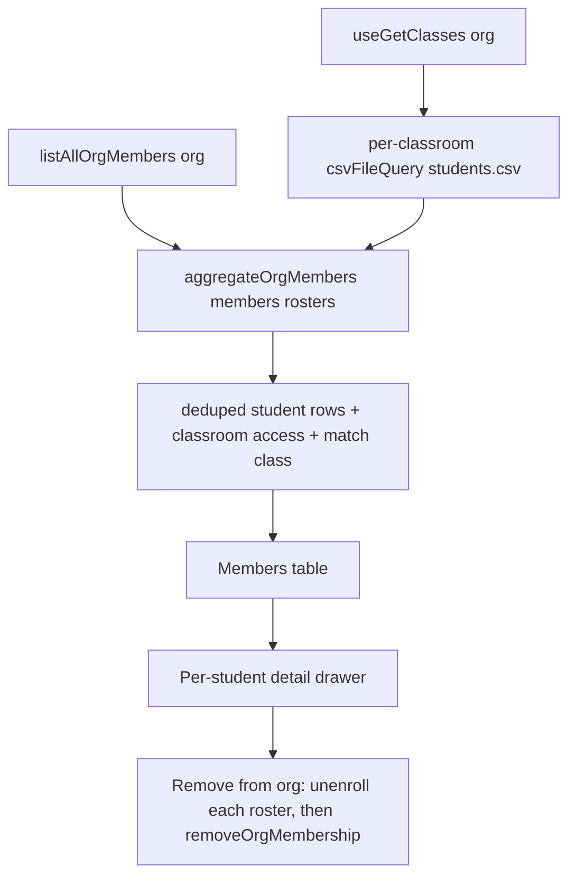
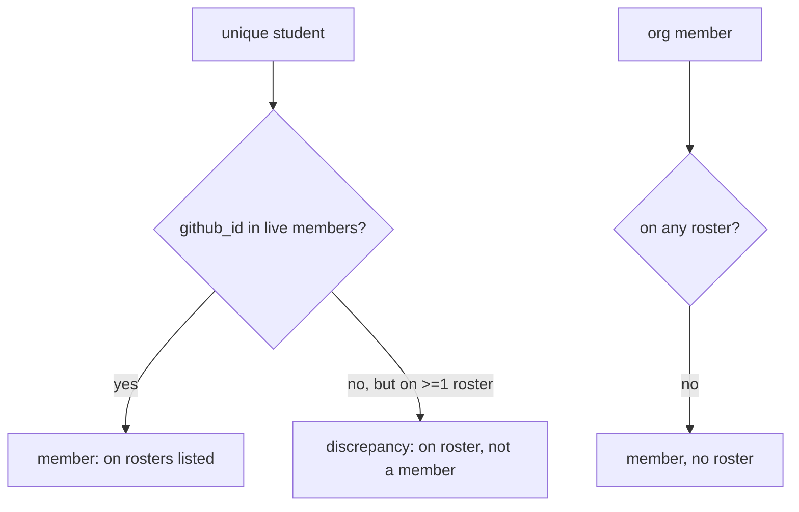

# Student Unenroll Correctness and Org Members Page - Plan

## Goal Capsule

- Objective: Stop per-classroom unenroll from leaving a student `enrolled` on other rosters while non-member of the org, and add a teacher-only org Members page that aggregates rosters, matches them to org members, surfaces discrepancies, and hosts a cross-roster-aware org removal.
- Authority hierarchy: This plan and issue #76 govern scope. Repo conventions (TanStack file-based routing, react-query key/cache patterns, the existing roster/inviteStatus utilities) override any conflicting suggestion here. The signed-in-teacher self-removal guard in `unenrollStudent` is preserved unchanged.
- Stop conditions: Stop and surface a blocker if removing the org-removal path from unenroll would orphan a behavior other callers depend on, or if the Members aggregation cannot read a classroom roster for a reason other than 404/empty (e.g. a systemic 403 that means the whole page is unavailable).
- Execution profile: Standard TypeScript/React feature work. Tests via `npm run test` (vitest). No migration, no destructive data step beyond the existing org-membership DELETE, which moves to the Members page.
- Tail ownership: Implementer runs the verification gates and satisfies each unit's test scenarios before declaring done.

---

## Product Contract

### Summary

The student unenroll flow lets a teacher unenroll a student from one classroom and, in the same action, remove them from the GitHub organization. Unenroll only edits that one classroom's `students.csv`, but org removal is org-wide. When the same student is on two or more rosters, removing them from the org leaves every other classroom showing them as `enrolled` while they are no longer an org member — `buildInviteStatusLookup` then classifies those rows as `removed` (still bucketed under "Enrolled" in the UI), a silent inconsistency.

This plan removes the org-removal option from per-classroom unenroll, so a classroom-scoped action only ever touches that classroom. Org-level membership removal moves to a new teacher-only **Members** page under the org scope. That page aggregates every classroom's roster, deduplicates students, matches them to live org members by GitHub id, flags both discrepancy directions, shows all classroom access for a single student, and offers a "remove from organization" action that first offers to unenroll the student from every roster so no roster is left inconsistent.

### Problem Frame

`unenrollStudent` (`src/api/mutations/students.ts`) removes a row from one `students.csv`, drops the classroom-team membership, and — for an active member when `removeFromOrg` is set — calls `removeOrgMembership`, a bare org-wide `DELETE /orgs/{org}/memberships/{username}`. It never inspects other classrooms. `UnenrollStudentButton` (`src/pages/students/EnrolledStudents.tsx`) renders the `removeFromOrg` checkbox for any active member with no cross-roster awareness. The org has no aggregate view of who its members are or which classrooms they belong to, so a teacher cannot see a student's full footprint before removing them.

### Requirements

Unenroll correctness:

- R1. Per-classroom unenroll must not remove a student from the GitHub organization for an active member. The action is classroom-scoped: it removes the roster row and the classroom-team membership only.
- R2. A pending org invite is still cancelled on unenroll (unchanged behavior) — a not-yet-accepted invitee has no cross-classroom membership to protect.
- R3. The onboarding-repo reset for a not-yet-enrolled student on unenroll is unchanged.
- R4. The `UnenrollStudentButton` dialog no longer shows the "Also remove from org" checkbox; its copy reflects classroom-only scope.
- R5. The signed-in-teacher self-removal guard remains; with org removal gone from this path it only governs the pending-invite case.

Members page — aggregation and matching:

- R6. A teacher-only Members page exists under the org scope, reachable from org navigation.
- R7. The page lists org members (paged through all pages, not just the first 100), each shown with avatar, login, and name.
- R8. The page aggregates every classroom roster (including archived classrooms, badged as archived) and deduplicates students across rosters by stable identity (`github_id`, else `username`, else `email`).
- R9. Each unique student is matched to a live org member by numeric GitHub id; the row records every classroom they appear on with that classroom's `enrollment_status` and `section`.
- R10. The page flags both discrepancy directions: on a roster but not an org member (the issue's bug), and an org member on no roster.

Members page — per-student view and removal:

- R11. Selecting a student shows all their classroom access: each classroom, status, and section, plus their org-membership state.
- R12. The per-student view offers "Remove from organization". When the student is still on one or more rosters, it first offers to unenroll them from every classroom, then removes the org membership, so no roster is left inconsistent.
- R13. The signed-in teacher cannot remove themselves from the org via this action (mirrors the existing unenroll self-guard).

### Scope Boundaries

In scope: the unenroll mutation change, the unenroll dialog change, the new Members page (route, page, data hook, per-student detail, removal action), and a navigation entry.

#### Deferred to Follow-Up Work

- Bulk org-member removal (multi-select) on the Members page.
- A "repair" one-click that re-invites or re-enrolls a `removed` student. The Members page surfaces the discrepancy; remediation beyond removal is a later iteration.
- Surfacing teachers/TAs distinctly from students on the Members page (role classification beyond member-vs-roster).

#### Outside this change

- The onboarding/reconcile pipeline and self-report matching.
- Student-facing views.
- Classroom-team provisioning mechanics beyond the team removal unenroll already performs.

---

## Planning Contract

### Key Technical Decisions

- KTD1. Remove `removeFromOrg` from the per-classroom unenroll path entirely. `unenrollStudent` keeps cancelling a `pending` invite (R2) but no longer removes an `active` member. The `UnenrollStudentInput.removeFromOrg` field and the active-member branch of `shouldRemoveFromOrg` are deleted; the pending branch stays. This is simpler and safer than making the checkbox cross-classroom-aware: a classroom-scoped UI never owns an org-scoped decision, so there is no per-roster scan to get wrong at unenroll time. Org removal is centralized on the Members page where the full footprint is visible (KTD5).
- KTD2. Reuse the existing roster identity and matching primitives rather than inventing new ones. Dedupe key follows `studentKey` (`github_id || username || email`, `src/util/roster.ts`); member matching follows `memberIdSet` on numeric id (`src/util/inviteStatus.ts`). This keeps the Members page's notion of "same student" and "is a member" identical to the per-classroom roster, so the two views never disagree.
- KTD3. Build the aggregation as a pure function plus a thin react-query-composing hook. A pure `aggregateOrgMembers(members, rosters)` in a new `src/util/orgMembers.ts` takes the org member list and an array of `{ classroom, archived, students }` and returns the deduplicated, matched, classified rows. The hook `useGetOrgMembership` (new, `src/hooks/useGetOrgMembership.ts`) composes `useGetOrgMembers`, `useGetClasses`, and a fan-out of `csvFileQuery` per classroom, then calls the pure function. Purity makes the dedup/match/classify logic unit-testable without mocking react-query.
- KTD4. Page org members through all pages. `listOrgMembers(client, org, page)` already takes a page arg but `useGetOrgMembers` only fetches page 1. Add a paged variant (`listAllOrgMembers`) that loops until a short page, and have the Members aggregation use it. Leave `useGetOrgMembers` (used by the per-classroom roster, where 100 is effectively always enough and the extra requests would be wasteful) as-is to avoid a broad behavior change; the Members page opts into the paged fetch.
- KTD5. Org removal on the Members page is a sequenced action, not a single DELETE. When a student is still on N rosters, the action first unenrolls them from each classroom (reusing `unenrollStudent` with the now-org-safe semantics — roster row + team only), then calls `removeOrgMembership`. Each per-classroom unenroll is independent; a failure on one is surfaced as a warning and does not abort the others, mirroring the warning-accumulation pattern already in `unenrollStudent`. The org DELETE runs last so a partial failure never removes the membership while leaving rosters populated.
- KTD6. Roster reads in the aggregation tolerate per-classroom failure. A single classroom whose `students.csv` 404s or fails to parse contributes zero students and a non-fatal note, rather than failing the whole page. Aligns with the best-effort posture already used in `reconcileOnboarding`/unenroll cleanup.
- KTD7. The page is gated by `RequireTeacher` and lives at `/_authed/$org/members/`, parallel to `/_authed/$org/settings/`. Navigation entry added to `MyClasses` in `src/components/drawer/index.tsx` next to Published/Settings, gated on `showTeacherUi`.

### High-Level Technical Design

Aggregation data flow for the Members page:

Classification each aggregated row carries (drives the badges in R10):

### Assumptions

- The teacher viewing the Members page is an org owner, so `listOrgMembers` and `removeOrgMembership` succeed; non-owner access already 404s via `RequireTeacher`/GitHub enforcement, consistent with other teacher pages.
- A classroom's roster path is `classroom50/<classroom>/students.csv` (the established contract used by `useGetStudents`).

### Sequencing

U1 (unenroll mutation) and U2 (unenroll dialog) are independent of the Members page and land first — they directly fix the bug. U3 (paged members) and U4 (aggregation util) are pure/data foundations for U5 (hook), U6 (page + route + nav), and U7 (per-student detail + removal). U7 depends on U1 because its removal action reuses the org-safe `unenrollStudent`.

---

## Implementation Units

### U1. Make unenroll classroom-scoped (drop active-member org removal)

- Goal: `unenrollStudent` never removes an active org member; it still cancels a pending invite. Implements R1, R2, R3, R5.
- Requirements: R1, R2, R3, R5.
- Dependencies: none.
- Files: `src/api/mutations/students.ts`, `src/api/mutations/students.test.ts`.
- Approach: Remove the `removeFromOrg` field from `UnenrollStudentInput` and drop it from the destructure. Change `shouldRemoveFromOrg` so it is true only for `orgState === "pending"` (the active-member-with-opt-in arm is deleted). Keep the `isSelf` guard, but it now only matters for the pending case; keep the team removal, onboarding-repo reset, and warning accumulation untouched. The returned shape (with `teamWarning`) is unchanged.
- Patterns to follow: the existing warning-accumulation and best-effort try/catch already in this function; don't introduce new control flow.
- Test scenarios:
  - Active member unenrolled: roster row removed, classroom-team removal attempted, `removeOrgMembership` NOT called (assert the memberships DELETE never fires). Covers R1.
  - Pending invitee unenrolled: pending invite still cancelled via the memberships DELETE. Covers R2.
  - Student on two rosters (simulate by asserting only the target classroom's `students.csv` is committed): unenroll from one classroom does not touch the other roster and does not remove org membership. Covers R1.
  - Not-yet-enrolled student with a `github_id`: onboarding-repo reset still attempted. Covers R3.
  - Self (signed-in viewer) as a pending invitee: still guarded (no self-removal), warning surfaced. Covers R5.
- Verification: `npm run test` (vitest, scoped to `src/api/mutations/students.test.ts`) passes; no call path in `unenrollStudent` reaches `removeOrgMembership` for an `active` state.

### U2. Remove the org-removal checkbox from the unenroll dialog

- Goal: `UnenrollStudentButton` no longer offers org removal; copy reflects classroom-only scope. Implements R4.
- Requirements: R4.
- Dependencies: U1.
- Files: `src/pages/students/EnrolledStudents.tsx`.
- Approach: Delete the `removeFromOrg` state, the `canRemoveFromOrg` derivation, the checkbox `<label>` block, and the `removeFromOrg`-dependent confirm-button label branch. The mutation call drops the `removeFromOrg` argument (now removed from the input type by U1). Keep the pending-invite explanatory line and the self-member notice. The confirm button label collapses to "Unenroll student" (and the pending/onboarding variants already present).
- Patterns to follow: existing dialog structure and `closeDialog`/submit flow; only remove, don't restructure.
- Test scenarios: Test expectation: none — UI removal with no new behavior; covered by U1's mutation tests and the type change (the `removeFromOrg` argument no longer compiles).
- Verification: `npm run typecheck` (`tsc -b`) passes with the `removeFromOrg` argument gone; the dialog renders without the checkbox for an active member.

### U3. Page through all org members

- Goal: A paged member fetch the Members page can rely on for large orgs. Implements R7.
- Requirements: R7.
- Dependencies: none.
- Files: `src/hooks/github/queries.ts`, `src/hooks/github/queries.test.ts` (create if absent, else colocate).
- Approach: Add `listAllOrgMembers(client, org)` that loops `listOrgMembers(client, org, page)` incrementing `page` until a page returns fewer than 100 entries, concatenating results. Leave `listOrgMembers` and `useGetOrgMembers` unchanged (KTD4).
- Patterns to follow: existing `listOrgMembers` signature and `client.request` usage.
- Test scenarios:
  - Single short page (under 100): one request, returns that page.
  - Exactly 100 then a short page: two requests, concatenated; stops after the short page.
  - Empty org: one request, empty array.
- Verification: unit test passes; function stops paging on the first short page.

### U4. Aggregation utility: dedupe, match, classify

- Goal: Pure `aggregateOrgMembers` turning members + rosters into classified, deduped student rows. Implements R8, R9, R10.
- Requirements: R8, R9, R10.
- Dependencies: none.
- Files: `src/util/orgMembers.ts`, `src/util/orgMembers.test.ts`.
- Approach: Export a type for an aggregated row: identity fields, `classrooms: { classroom; archived; enrollment_status; section }[]`, `isMember: boolean`, and a `classification` of `member-on-roster | on-roster-not-member | member-no-roster`. `aggregateOrgMembers(members, rosters)` where `rosters: { classroom; archived; students: Student[] }[]`: build `memberIdSet(members)`; iterate every roster's students accumulating into a map keyed by `studentKey`; for each unique student, set `isMember` by matching `github_id` against the member-id set; then fold in org members that matched no roster as `member-no-roster` rows (login/name from the member object). Classify per the U4 diagram. Sort stably (e.g. discrepancies first, then by login/name) — sort order is a presentation choice the implementer may set.
- Patterns to follow: `studentKey` and `memberIdSet`; mirror their exact comparison semantics so the page agrees with per-classroom rosters (KTD2).
- Test scenarios:
  - Same student on two rosters dedupes to one row listing both classrooms with each classroom's status/section. Covers R8, R9.
  - Student with `github_id` present in members → `member-on-roster`; absent from members → `on-roster-not-member`. Covers R9, R10.
  - Org member appearing on no roster → `member-no-roster`. Covers R10.
  - Email-only student (no `github_id`, no `username`) dedupes by email and is `on-roster-not-member`. Covers R8.
  - Archived classroom's students still aggregated and carry `archived: true`. Covers R8.
  - Two roster rows that collapse to the same key but differ in section: both classroom entries retained under one student.
- Verification: `npm run test` (scoped to `src/util/orgMembers.test.ts`) passes.

### U5. Org membership hook

- Goal: `useGetOrgMembership` composes the data sources and returns aggregated rows plus loading/availability state. Implements R6 (data side), R7, R8, R9, R10.
- Requirements: R7, R8, R9, R10.
- Dependencies: U3, U4.
- Files: `src/hooks/useGetOrgMembership.ts`.
- Approach: Use a query for `listAllOrgMembers`, `useGetClasses(org)` for classroom dirs, and fan out `csvFileQuery<Student>` per classroom via `useQueries` (mapping each through `toStudent`, matching `useGetStudents`), reading each classroom's archived flag from its `classroom.json` (reuse the existing classroom metadata source the classes list already exposes, or fetch per classroom; implementer picks the cheaper path already cached). Tolerate per-classroom roster failure (KTD6): a failed/absent roster contributes no students. Call `aggregateOrgMembers` in a `useMemo`. Return `{ rows, isLoading, isError, notes }` where `notes` carries per-classroom read failures.
- Patterns to follow: `useGetStudents` (`toStudent` mapping, `csvFileQuery`), `useRosterStatus` (composing multiple queries with `useMemo`), `useGetClasses`.
- Test scenarios: Test expectation: none at the hook level (thin react-query composition); the dedupe/match/classify logic is covered by U4, paging by U3. If the repo has a hook-testing harness, add one happy-path render test asserting `rows` is populated and a failing-roster note is surfaced.
- Verification: typecheck passes; the hook returns aggregated rows in a manual render and degrades gracefully when one roster 404s.

### U6. Members page, route, and navigation

- Goal: A teacher-only Members page listing members with their classroom access, plus a nav entry. Implements R6, R7, R10 (presentation).
- Requirements: R6, R7, R10.
- Dependencies: U5.
- Files: `src/pages/OrgMembersPage.tsx`, `src/routes/_authed/$org/members/index.tsx`, `src/components/drawer/index.tsx`.
- Approach: Page mirrors `OrgSettingsPage`'s shell (`Drawer`/`DrawerContent`/`RequireTeacher`, `DrawerSidebar page="classes"`). Render a searchable table of aggregated rows: avatar (reuse `Avatar`), login/name, a matched/unmatched badge, and a count or compact list of classroom access. Filter/search by login or name. Discrepancy rows (`on-roster-not-member`) get a warning badge; `member-no-roster` rows an info badge. Add the route file delegating to the page (mirror `src/routes/_authed/$org/settings/index.tsx`). In `MyClasses` (`src/components/drawer/index.tsx`) add a "Members" `<Link to="/$org/members">` entry next to Published/Settings, gated on `showTeacherUi`, with an appropriate lucide icon (e.g. `UsersRound`); wire its `active` state via a `selected`/route match like the existing entries.
- Patterns to follow: `OrgSettingsPage` shell and `RequireTeacher`; `MyClasses` link/active patterns; `Avatar` usage and badge classes from `EnrolledStudents`.
- Test scenarios: Test expectation: none — presentation over the U4/U5-covered data. If the repo has component tests for similar pages, add one asserting a discrepancy row renders the warning badge.
- Verification: typecheck/lint pass; navigating to `/$org/members` as a teacher renders the table; a non-teacher gets `NotFound` via `RequireTeacher`.

### U7. Per-student detail and cross-roster-aware org removal

- Goal: A per-student view of all classroom access plus a sequenced "remove from organization" action. Implements R11, R12, R13.
- Requirements: R11, R12, R13.
- Dependencies: U1, U6.
- Files: `src/pages/OrgMembersPage.tsx` (detail drawer/modal + action), `src/pages/orgMembers/RemoveFromOrg.tsx` (optional extraction for the removal flow).
- Approach: Selecting a row opens a detail drawer listing every classroom the student is on (classroom, status, section) and their org-membership state (R11). A "Remove from organization" button (hidden when the row is the signed-in viewer, R13) opens a confirm dialog that, when the student is on >=1 roster, lists those classrooms and explains they will be unenrolled first. On confirm: for each classroom, call `unenrollStudent` (org-safe after U1) with that classroom + the student; accumulate per-classroom warnings without aborting; then call `removeOrgMembership` last (KTD5). Surface a combined success/warning summary and invalidate the members + per-classroom roster queries and `invalidateInviteQueries`. Disable/withhold the action for `member-no-roster` rows? No — those are removable directly (no rosters to clear), so the same path runs with zero unenroll steps.
- Patterns to follow: `unenrollStudent` warning accumulation; `EnrolledStudents` dialog + `invalidateInviteQueries`/`updateRosterCache`; `removeOrgMembership` 404-tolerance.
- Test scenarios: extract the sequencing into a small pure/async helper if practical and test it; otherwise cover via the helper in `src/pages/orgMembers/`:
  - Student on two rosters: both classrooms unenrolled (assert `unenrollStudent` called per classroom), then `removeOrgMembership` called once, last. Covers R12.
  - One per-classroom unenroll fails: the other still runs, `removeOrgMembership` still called, failure surfaced as a warning (not thrown). Covers R12.
  - `member-no-roster` student: no unenroll calls, `removeOrgMembership` called once. Covers R12.
  - Signed-in viewer row: removal action not offered. Covers R13.
- Verification: `npm run test` for the removal-sequence helper passes; manual check that removing a two-roster student clears both rosters and the org membership and the table refreshes.

---

## Verification Contract

| Gate | Command | Applies to |
|---|---|---|
| Unit tests | `npm run test` (vitest run) | U1, U3, U4, U7 |
| Typecheck | `npm run typecheck` (`tsc -b`) | U2, U5, U6 (and all) |
| Lint | `npm run lint` (`eslint .`) | all |
| Full check | `npm run check` (`tsc -b && eslint . && prettier --check . && vitest run`) | pre-merge |

Behavioral gates:

- `unenrollStudent` never issues the org memberships DELETE for an `active` membership state (U1 test asserts this directly).
- A two-roster student unenrolled from one classroom remains intact on the other roster and an org member (U1).
- `aggregateOrgMembers` produces one row per unique student with all classroom access and the correct classification (U4).
- Org removal from the Members page unenrolls every roster before the org DELETE, and a per-roster failure does not abort the sequence (U7).

---

## Definition of Done

Global:

- All Verification Contract gates pass (`npm run check`).
- The per-classroom unenroll dialog has no org-removal affordance; org removal exists only on the Members page.
- A teacher can open `/$org/members`, see all members with classroom access, identify discrepancy rows, open a single student's full access, and remove a member from the org in a way that leaves no roster inconsistent.
- No abandoned/experimental code left in the diff (e.g. an unused `removeFromOrg` remnant or a dead aggregation branch).

Per-unit:

- U1: active-member org removal path deleted; pending-invite cancellation and self-guard preserved; tests cover active, pending, two-roster, onboarding-reset, and self cases.
- U2: checkbox and its state/label branches removed; typecheck clean with the dropped argument.
- U3: `listAllOrgMembers` pages to completion; tests cover short, exactly-100-then-short, and empty.
- U4: dedupe/match/classify covered for member, on-roster-not-member, member-no-roster, email-only, and archived cases.
- U5: hook composes paged members + per-classroom rosters, tolerates a failing roster, returns aggregated rows.
- U6: route, page, and gated nav entry render for teachers and 404 for non-teachers; discrepancy badges shown.
- U7: per-student detail lists all access; removal sequences unenroll-then-DELETE, accumulates warnings, withholds self-removal, and refreshes the relevant queries.

---

## Sources / Research

- Issue: foundation50/classroom50-web#76 (origin; problem statement and the two-part ask).
- Unenroll mutation: `src/api/mutations/students.ts` — `unenrollStudent`, `UnenrollStudentInput`, the `shouldRemoveFromOrg`/`removeOrgMembership` branch.
- Unenroll dialog: `src/pages/students/EnrolledStudents.tsx` — `UnenrollStudentButton`, the `removeFromOrg` checkbox.
- Status classification (why a removed member still shows under Enrolled): `src/util/inviteStatus.ts` — `buildInviteStatusLookup` returns `removed` for an `enrolled` row whose `github_id` left the org; `partitionRoster` buckets `removed` under Enrolled (`src/util/roster.ts`).
- Identity/match primitives: `studentKey` (`src/util/roster.ts`), `memberIdSet` (`src/util/inviteStatus.ts`).
- Members + rosters data layer: `listOrgMembers`/`useGetOrgMembers`, `csvFileQuery`/`useGetStudents`, `useGetClasses`, `getOrgMembershipState`/`removeOrgMembership` (`src/hooks/github/queries.ts`, `src/hooks/github/mutations.ts`).
- Page/nav patterns: `OrgSettingsPage` (`src/pages/OrgSettingsPage.tsx`), `RequireTeacher` (`src/components/RequireTeacher.tsx`), `MyClasses`/`Avatar` (`src/components/drawer/index.tsx`, `src/components/avatar/index.tsx`), settings route (`src/routes/_authed/$org/settings/index.tsx`).
