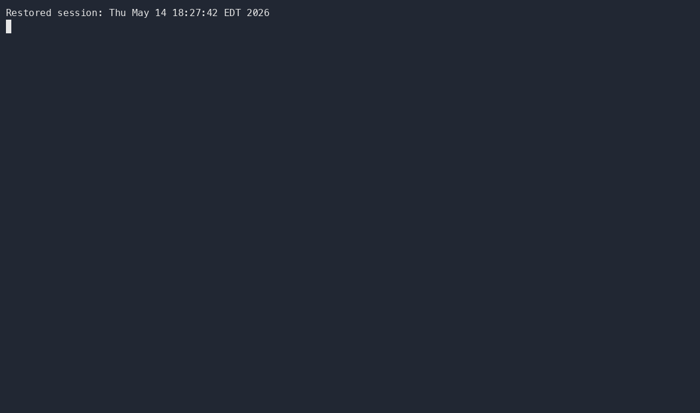
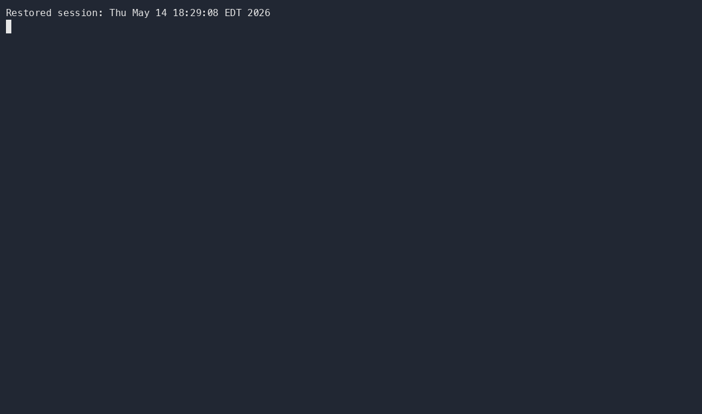

# Student Guide

End-to-end walkthrough for students. Install the CLI first — see [Installation](Installation).

## Before you start

Your instructor must have already:

1. Set up a GitHub organization for the class.
2. Created an assignment template repo in that org.
3. Invited you to the org (you'll get an email invitation).

You don't need to accept the org invitation in the GitHub UI — `gh student accept` does it for you on first use.

## 1. Log in

```sh
gh student login
```


This runs `gh auth login` with the `read:org` and `repo` scopes that the classroom commands need. If you skip this step, the next command you run will trigger the login flow automatically.

`gh student logout` mirrors `gh auth logout`.

## 2. Accept an assignment

```sh
gh student accept <org> <classroom> <assignment>
```



- `<org>` — the GitHub org your class uses.
- `<classroom>` — a free-form label your class agrees on (e.g. `cs50-fall-2026`). It's recorded in `.classroom50.yml` inside your repo and used as a prefix when the teacher collects submissions.
- `<assignment>` — the slug of the template repo (e.g. `hello`).

What this command does:

1. Auto-accepts any pending org invitation for your account.
2. Creates a **private** copy of the template at `<org>/<classroom>-<assignment>-<username>` (lowercased), with issues, projects, and wiki disabled.
3. Adds you as a `maintain` collaborator on the new repo.
4. Writes `.classroom50.yml` to your repo with metadata pointing back at the template.
5. Prints the `git clone` command for your new repo.

If you've already accepted this assignment, the command short-circuits with `Assignment already accepted: <org>/<repo>` and leaves your existing repo (and any work in it) alone — re-running is safe.

## 3. Clone and work

Run the `git clone` command that `gh student accept` printed. Edit the code in your usual editor, commit and push to your repo's `main` branch as you normally would.

If you'd like to collaborate with a classmate or invite a TA to your repo:

```sh
gh student invite <org>/<repo> <username>
```

That adds them with `push` permission.

## 4. Submit

From inside the cloned repo:

```sh
gh student submit
```



`gh student submit` snapshots your current branch and pushes it as a new commit on top of the assignment repo's `main` branch (hardcoded for now). Before snapshotting, it fetches the latest instructor `.gitignore` and `.github/` (if present) from the template, so any autograding the teacher updates flows back into your repo automatically.

Run this after each meaningful change — the latest submission is what your teacher sees.

A few useful properties:

- **History is preserved.** Submissions overlay as commits on top of the existing `main`; prior commits stay reachable for review.
- **No git config required.** The commit is authored with your GitHub login and noreply email, passed via `git -c user.name=... -c user.email=...`, so a fresh shell with no global git identity still submits cleanly. `GIT_AUTHOR_*` / `GIT_COMMITTER_*` environment variables override these defaults if you want a custom identity.
- **Build artifacts are excluded.** Only tracked files plus untracked-not-ignored files are submitted, so build outputs and unrelated local files don't end up in the snapshot.

## See also

- [`gh student` command reference](gh-student) — every command and flag.
- [Troubleshooting](Troubleshooting) — debug flags, common errors.
