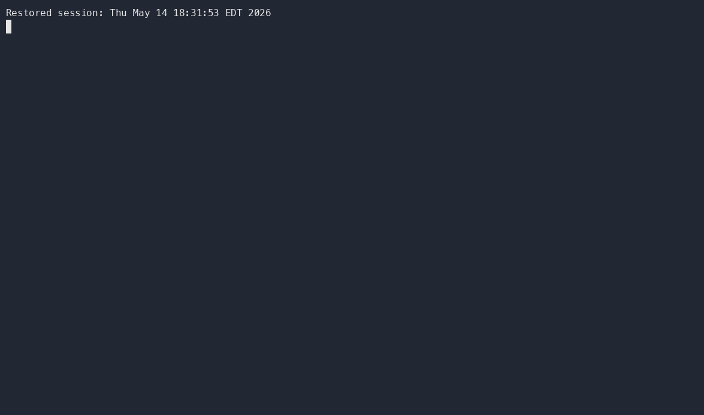
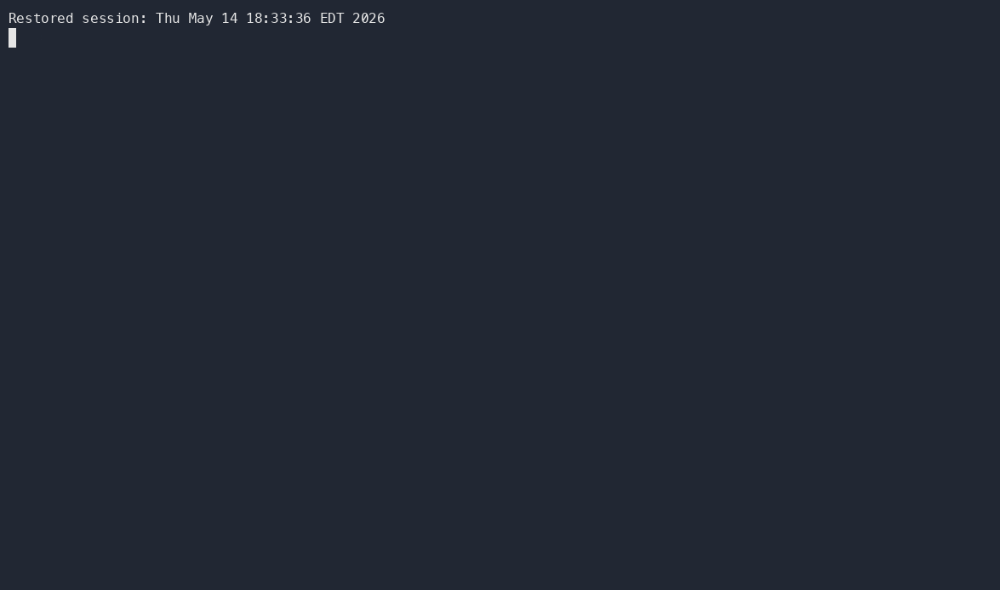

# Teacher Guide

End-to-end walkthrough for instructors. Each step assumes the previous ones are done. Install the CLI first — see [Installation](Installation).

## 1. Set up the organization (one-time, on github.com)

The CLI doesn't create or configure orgs. Do these once via the GitHub web UI:

1. **Create the organization** at <https://github.com/account/organizations/new>.
2. **Set the org's base permission to "No permission"** at `https://github.com/organizations/<org>/settings/member_privileges` so students don't get implicit access to other repos in the org.
3. **Create a template assignment repo.** Any repo flagged as a template (Settings → "Template repository") works. **The template must be public** so students can read it: the "No permission" baseline from the previous step blocks org members from reading private repos they aren't explicit collaborators on, and a private template would 404 on `gh student accept`. The Free and Team plans don't have a way around this. (GitHub Enterprise Cloud has a third visibility called "internal" that all enterprise members can read without per-repo collaboration; on that plan an internal template works without going public — see [GitHub's docs on internal repositories](https://docs.github.com/en/enterprise-cloud@latest/repositories/creating-and-managing-repositories/about-repositories#about-internal-repositories).) See [Assignment Templates](Assignment-Templates) for the expected file structure; copy that layout into your own template repo.

## 2. Log in with the right scopes

Org invitations require the `admin:org` OAuth scope, which `gh auth login` doesn't grant by default. Run once:

```sh
gh teacher login
```



This shells out to `gh auth login -s admin:org` and opens a browser to authorize. If you haven't logged in to `gh` before, it performs the initial login and grants `admin:org` in one shot; if you have, it re-authenticates with the new scope appended.

If you skip this step and run another command first (e.g. `gh teacher invite`), it will detect the missing scope and run `gh teacher login` for you before continuing.

## 3. Bootstrap the classroom50 config repo

Run once per teaching org to create `<org>/classroom50` — the private config repo that will hold classroom metadata, published assignment manifests, and collected scores:

```sh
CLASSROOM50_COLLECT_TOKEN=ghp_xxx gh teacher init <org>
```

Or omit the env var and the command prompts for the token interactively:

```sh
gh teacher init <org>
```

`init` is idempotent: re-running picks up where a prior run left off (it does not overwrite teacher edits to the skeleton).

**Collect token.** Supply a fine-grained PAT with **Contents: read** on org repos whose names match `<classroom>-*`. Store it only via the `CLASSROOM50_COLLECT_TOKEN` environment variable or a hidden stdin prompt — there is no `--collect-token` flag (command-line PATs leak via shell history and process listings). Use an org-owned service account, not a personal teacher account; pass `--service-account-confirm` to silence the reminder. Rotate before expiry (PATs are typically 90 days) with:

```sh
gh teacher rotate-collect-token <org>
```

**What `init` sets up:** private `classroom50` repo with `auto_init`, embedded workflows (`publish-pages.yml`, placeholder `collect-scores.yml`), GitHub Pages (workflow build), branch protection on the default branch, workflow `GITHUB_TOKEN` permissions (409 tolerated when the org enforces a stricter policy — skeleton workflows declare their own workflow-level `permissions:` blocks), and the repo-level `CLASSROOM50_COLLECT_TOKEN` Actions secret.

**Plan check.** `init` warns when the org is not on Team or Enterprise Cloud (required for Pages from a private repo). The warning is advisory; you can still proceed.

After `init` completes, the CLI prints the future Pages URL (`https://<org>.github.io/classroom50/`) and suggests `gh teacher classroom add` (not yet implemented in this release — see the command reference for current commands).

## 4. Invite students to the org

For each student:

```sh
gh teacher invite <org> <username>
```



The student gets an email invitation. They can accept it by visiting `https://github.com/<org>`, or skip ahead and let `gh student accept` auto-accept the pending invite when they accept their first assignment.

Common API failures (missing scope, not an admin, org not found, already a member, pending invite) surface as actionable messages instead of raw HTTP errors.

To invite a teaching assistant as an org admin instead:

```sh
gh teacher invite --admin <org> <username>
```

To invite someone to a single repo rather than the whole org (e.g. a TA on a specific assignment):

```sh
gh teacher invite <org>/<repo> <username>                 # default: push
gh teacher invite -p maintain <org>/<repo> <username>     # other permissions
```

Permission options for `-p`: `pull`, `triage`, `push`, `maintain`, `admin`. Re-running with a different `-p` updates the existing collaborator's permission in place.

## 5. Remove students or TAs when needed

```sh
gh teacher remove <org> <username>           # remove from organization
gh teacher remove <org>/<repo> <username>    # remove from one repo
```

The org form revokes access to every repository in the org, removes the user from all teams, and cancels any pending invitation in one call. Both forms are idempotent — a 404 (user is not a member or collaborator) prints a clear message and exits 0 so re-runs are safe.

## 6. Download submissions

After students have run `gh student submit`, pull every student's latest submission for an assignment with:

```sh
gh teacher download <org> <classroom> <assignment>
```


This pages through the org's repos, finds every one whose name starts with `<classroom>-<assignment>-` (the convention `gh student accept` uses: `<classroom>-<assignment>-<username>`), and shells out to `gh repo clone` for each. Authentication flows through the current `gh` session — no separate git credential setup is needed for private classroom repos.

Each run produces a fresh timestamped folder named `<classroom>-<assignment>_submissions_YYYY_MM_DD_T_HH_MM_SS/` (24-hour local time), so re-running picks up newer submissions without overwriting earlier downloads. Override the destination with `-d`:

```sh
gh teacher download -d <dir> <org> <classroom> <assignment>     # literal, no timestamp
```

Existing target dirs are skipped, so re-runs with the same `-d` pick up new submissions without aborting on the ones already cloned. Pass `--quiet` / `-q` to suppress the per-repo summary and forward `--quiet` to git; pass `--verbose` / `-v` to stream raw git output instead of the concise `Cloning <name>... Done` summary.

## See also

- [`gh teacher` command reference](gh-teacher) — every command and flag.
- [Troubleshooting](Troubleshooting) — debug flags, common errors.
