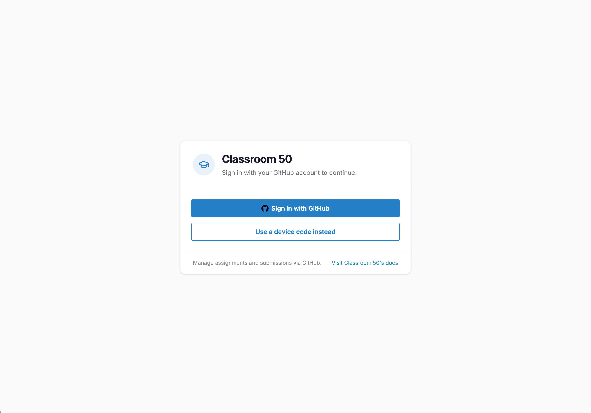
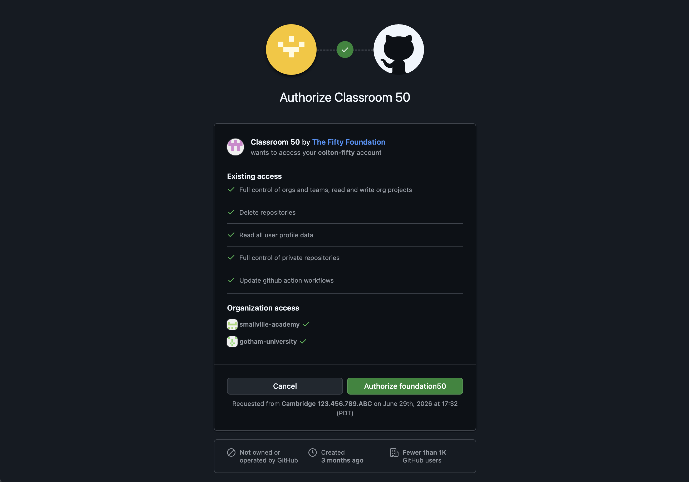
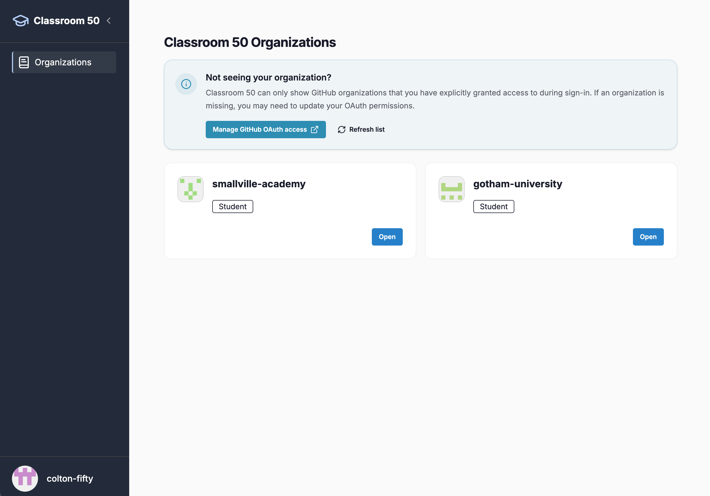
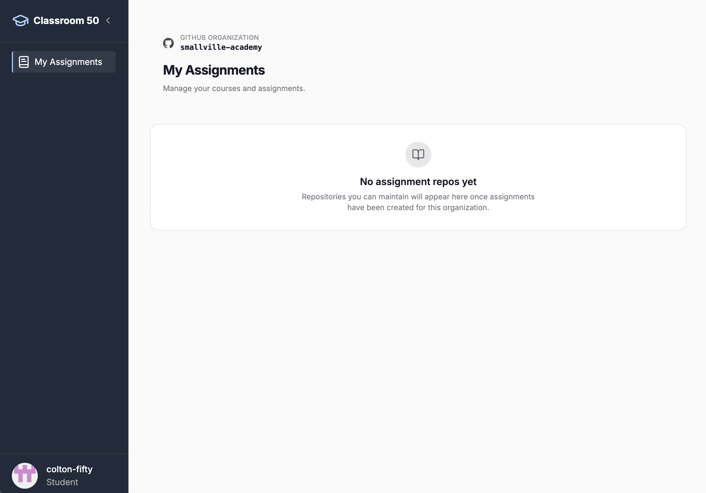
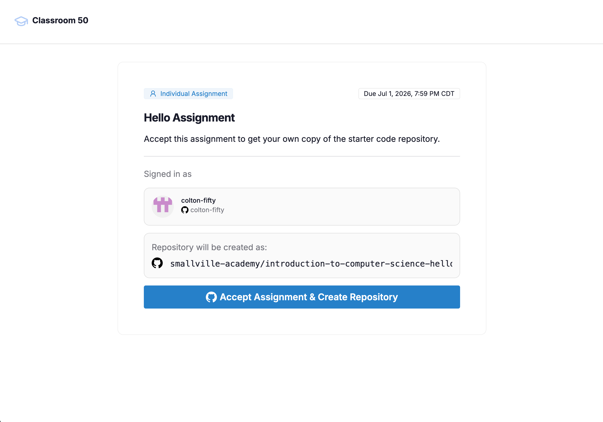
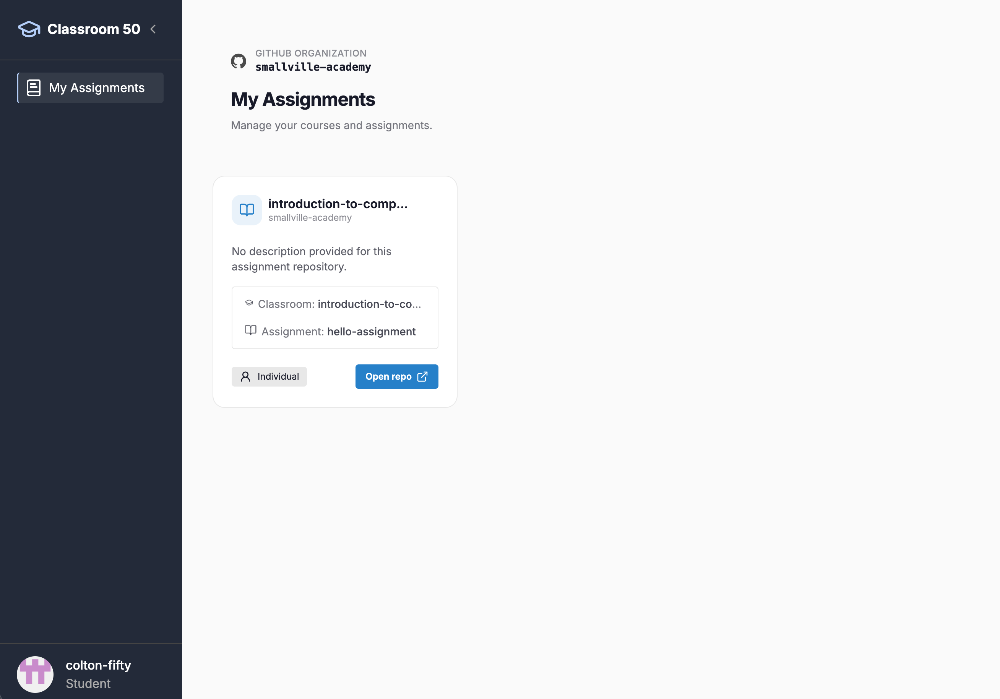
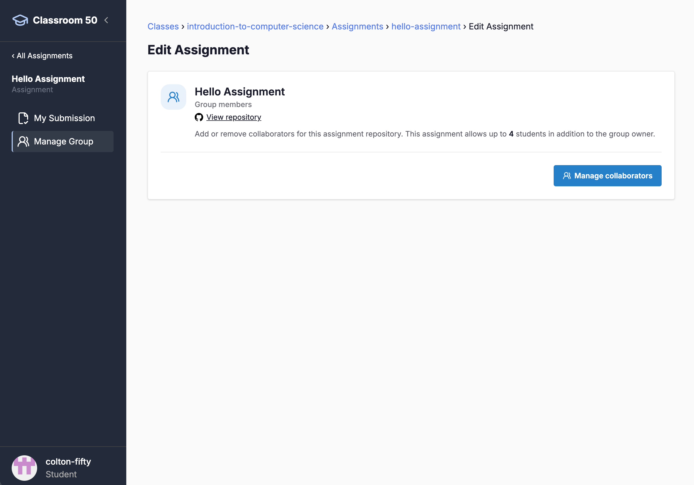
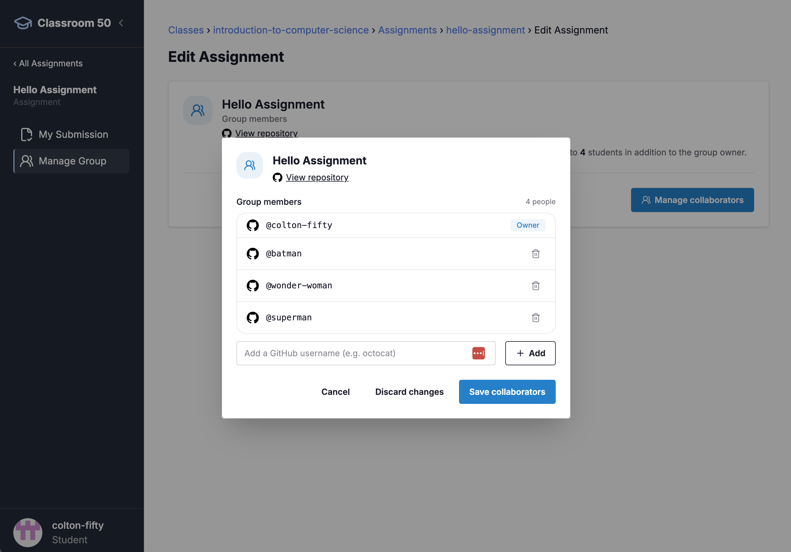
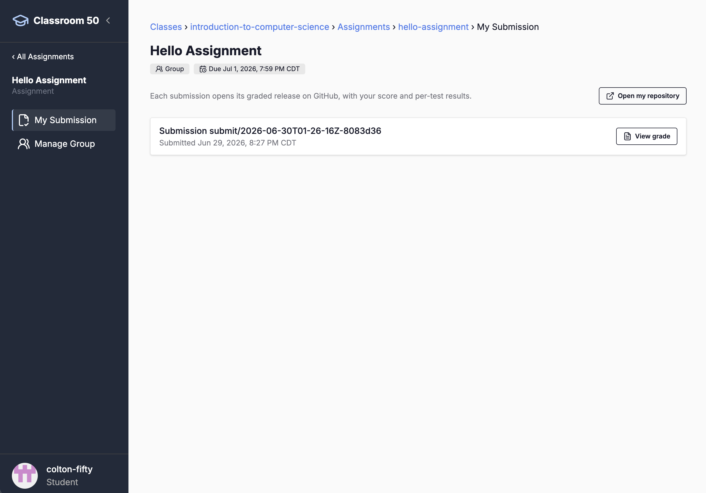

# Classroom 50 Web - Student Guide

Visit [classroom50.org](https://www.classroom50.org) to access the web interface.

# Introduction

This guide describes how to use Classroom 50 via its web interface at [classroom50.org](https://www.classroom50.org). Classroom 50 is also available as a [command-line tool](/CLI-Student-Guide.md).

This guide will cover the following topics, roughly in the order a student is likely to encounter them when joining a classroom in Classroom 50:

- [GitHub Setup](#github-setup)
- [Joining Your Classroom](#joining-your-classroom)
- [Logging Into Classroom 50](#logging-into-classroom-50)
- [Viewing Organizations](#viewing-organizations)
- [Accepting Assignments](#accepting-assignments)
- [Submitting Assignments](#submitting-assignments)
- [Group Assignments](#group-assignments)
- [Viewing Submissions](#viewing-submissions)

> As you use Classroom 50, if you have feature requests, discover bugs, or would like to suggest ideas for improvements, please reach out to us in our [discussion forums](https://github.com/foundation50/classroom50/discussions); we look forward to hearing from you!

# GitHub Setup

Classroom 50 is built entirely atop GitHub's existing infrastructure; as a result, in order to use Classroom 50 for your classrooms and assignments, [you will need a GitHub account first](https://docs.github.com/en/get-started/start-your-journey/creating-an-account-on-github).

# Joining Your Classroom

Before you can view and accept assignments for your classroom, you will need to be invited to the [GitHub organization](https://docs.github.com/en/organizations/collaborating-with-groups-in-organizations/about-organizations) to which your classroom belongs.

When your teacher invites you to the organization, you'll receive an email from GitHub with a link to accept the invitation. Accept the invitation before logging into Classroom 50.

# Logging into Classroom 50

When visiting [https://classroom50.org](https://classroom50.org), you'll be prompted with a login screen.

Classroom 50 uses your GitHub credentials to establish a connection to GitHub using [OAuth 2](https://oauth.net/2/). You have two options for how to sign in:

- **Sign in with GitHub**: This is a standard OAuth flow that will use your web browser to ask GitHub for permission to perform tasks on your behalf and then redirect back to the Classroom 50 app.
- **Use a device code instead**: This is a more manual process that can act as a fallback; it requires you to copy and paste an authentication code into a page on GitHub's website that then triggers a similar OAuth permissions authorization. Once complete, Classroom 50 will poll to verify that it's been completed.

# Viewing Organizations

After logging in, you'll see a list of GitHub organizations. Look for the organization that corresponds to the classroom you're joining and that has a "Student" label beneath it.

Clicking on any organization will then show you your list of assignments across the organization's classrooms to which you have access and have accepted.

# Accepting Assignments

When your teacher gives you a new assignment, you'll be sent a link to accept the assignment. When you visit the link, you can then accept the assignment on a page like the one below.

Once you've accepted the assignment, a GitHub repository will be created for you within the organization that's named after your classroom, the assignment, and your username, e.g., `introduction-to-computer-science-hello-assignment-username`.

After accepting an assignment, visiting your organization page again will show you at least one assignment/repository you now have created and have access to:

# Submitting Assignments

Because Classroom 50 is built atop GitHub, the process for assignment submission uses GitHub as well. Submitting involves [committing](https://github.com/git-guides/git-commit) and [pushing](https://github.com/git-guides/git-push) changes to the repository you created when accepting your assignment. If you're using the Classroom 50 CLI, [see the instructions here](https://github.com/foundation50/classroom50/wiki/CLI-Student-Guide#4-submit) for further details on how to submit your assignments.

# Group Assignments

On some assignments, you may be allowed to work in a group rather than individually. When accepting an assignment, you will see it tagged as either "Individual" or "Group" when doing so.

In the group assignment case, one student in your group should accept the assignment and the other students can be added as collaborators by the student who created the repository.

To access the interface for adding collaborators, first click the edit pencil at the top-right of a group assignment, which will take you to the following page:

Then, click the "Manage collaborators" button for the assignment to be taken to the following interface, where you can then add collaborators to your project (note that they must be members of the organization and enrolled in the classroom for this to work):

# Viewing Submissions

On the assignment page, it's also possible to view your submissions thus far. Click the "My Submission" link in the left menu to see them. Assuming you've submitted at least once, you should see something like this:

Classroom 50 is set up to run autograding for assignments by default. If your teacher has autograding configured for your assignment, clicking on "View grade" will take you to a page on GitHub where you can view the results for your submission.

